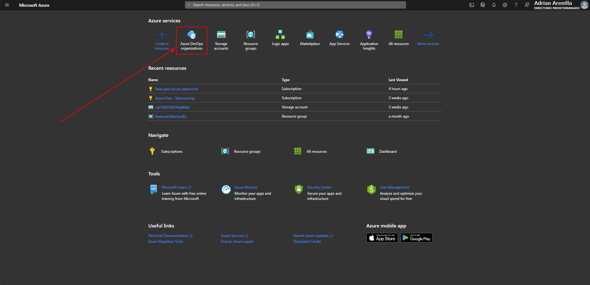
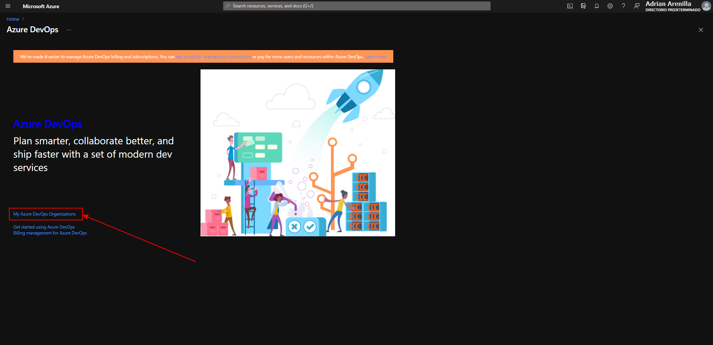
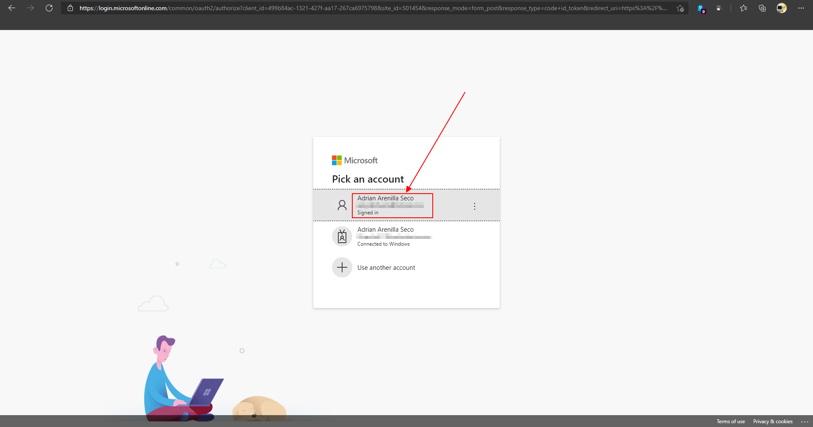
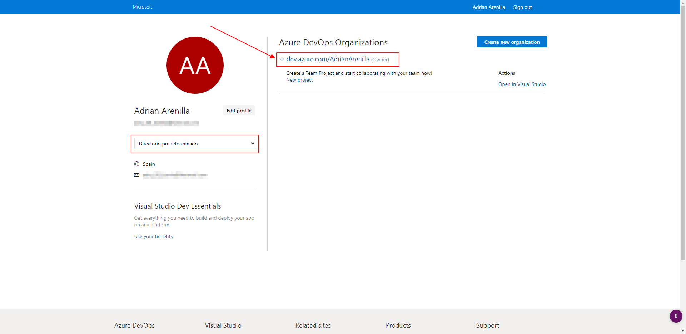
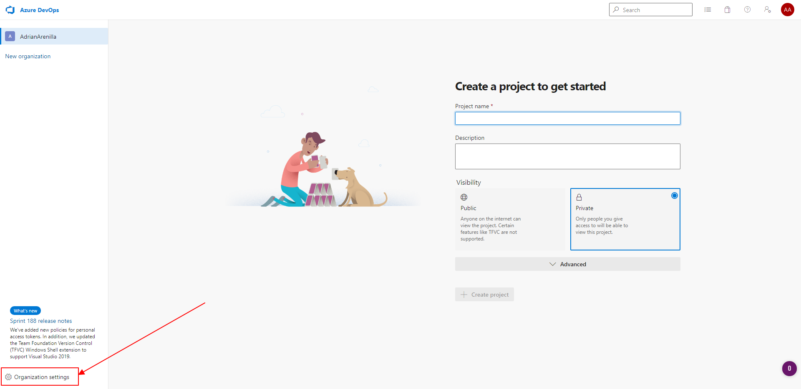
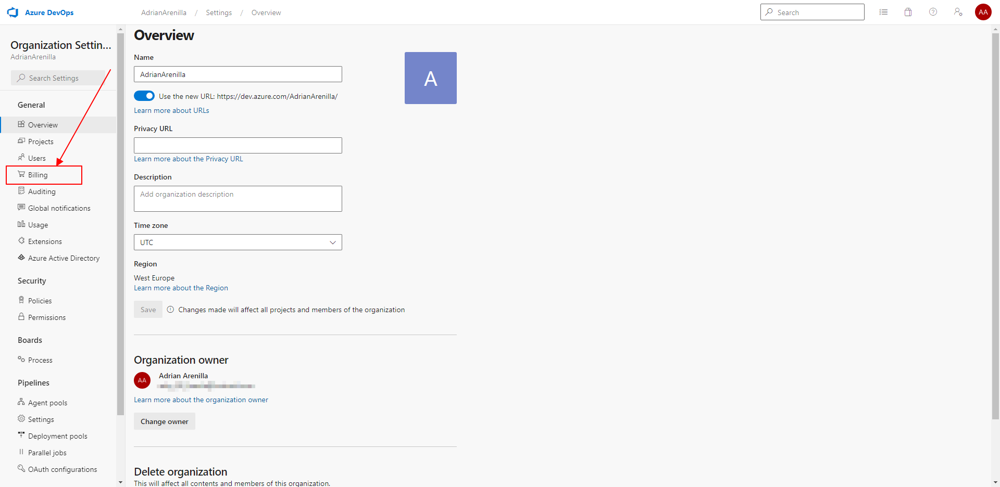
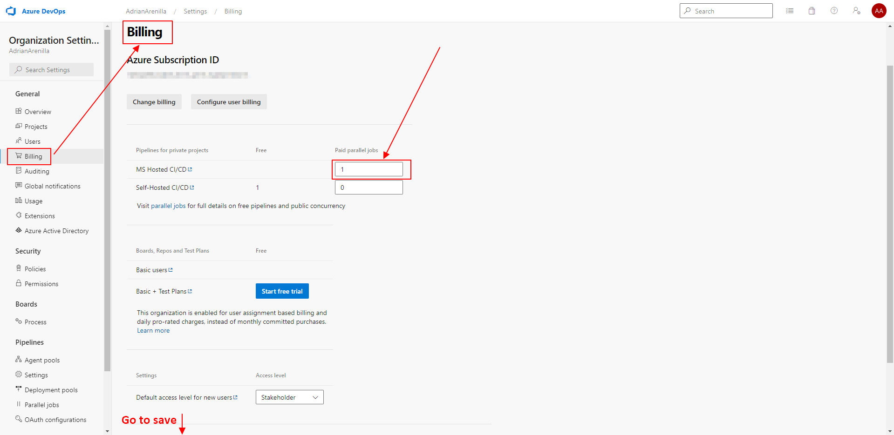

# Microsoft Az-400 (Adrián Arenilla Seco)

## Lab 00: Validate lab environment
In this lab we will learn how to create the working environment to start using Azure Devops.

### [Go to lab instructions -->](AZ400_M00_Validate_lab_environment.md)

Go to Azure DevOps Organizations within the Azure portal.

Click on the link labeled My Azure DevOps Organizations.

Sign in with the same account as the Azure portal.

Once the organization is created within our default directory, click on it.

Click Organization settings in the bottom left corner.

At the Organization settings screen click Billing.

Once the screen shows the linked Azure Subscription ID at the top, change the number of Paid parallel jobs for MS Hosted CI/CD from 0 to 1. Then click the SAVE button at the bottom.

### [<-- Back to readme](../README.md)

