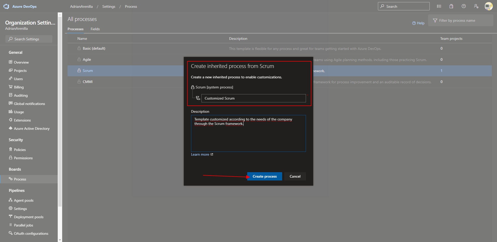

# Microsoft Az-400 (Adrián Arenilla Seco)

## Lab 01: Agile Planning and Portfolio Management with Azure Boards
In this lab, we'll learn about the agile portfolio management and planning processes and tools that Azure Boards provide and how they can help you quickly plan, manage, and track the work of your entire team. Explore product backlog, sprint backlog, and task boards that can be used to track workflow over the course of an iteration. We'll also see how the tools in this release have been enhanced to scale to larger teams and organizations.

### [Go to lab instructions -->](AZ400_M01_Agile_Planning_and_Portfolio_Management_with_Azure_Boards.md)

Sign in to Azure DevOps.

On the Azure DevOps Demo Builder page, click Accept to accept permission requests to access your Azure DevOps subscription.

Create New Project.

Project created successfully.

Created a new team.

Added all 3 sprints successfully.

Sub-areas added.

Created a work item of type "Epic".

Added worker to work item, area and iteration.

Create job link.

Related job link added.

Related work link added to the "Epic" work group.

Add Product Backlog Item.

Product backlog items added.

Product backlog items added to board.

Added new tasks.

Change the dashboard view to "work details".

Added vacation to the worker.

Work details panel has been updated to reflect your available bandwidth.

Add color to criteria rules.

Added tags.

Customization of tags with colors to differentiate them.
Added a new work column.

The work in progress limit of 1 indicates that only one work item should be in this stage at a time.

Created a new swim-lane within the work column "QA Approved".

Demo board finished.

Create inherited process from Scrum.

Added a new field to "Product Backlog Item".

Change of the project process to the customized Scrum.

Result of the field previously added to "Product Backlog Item".

Creation of a new dashboard assigned to a team.

Added 2 new widget to the dashboard.

Create a query to generate charts on the dashboard.

Query result in chart format.

### [<-- Back to readme](../README.md)

