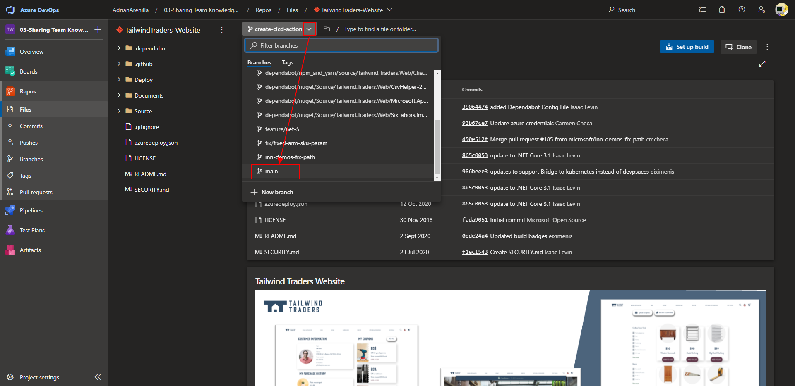
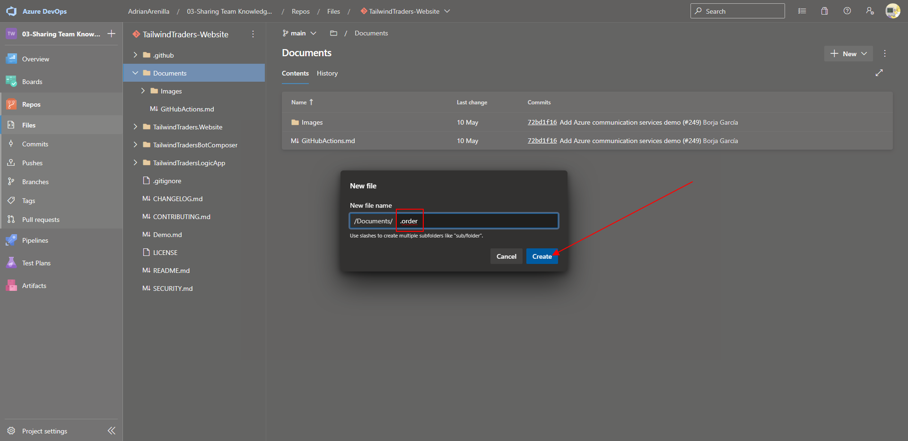

# Microsoft Az-400 (Adrián Arenilla Seco)

## Lab 03: Sharing Team Knowledge using Azure Project Wikis
In this lab, you will create and configure wiki in an Azure DevOps, including managing markdown content and creating a Mermaid diagram.

### [Go to lab instructions -->](AZ400_M03_Sharing_Team_Knowledge_using_Azure_Project_Wikis.md)


Project created successfully.


To select "TailwindTraders-Website"


Main branch.



Download "Website.png" into "TailwindTraders-Website".


Publish code as wiki into Tailwind Traders.


Publish into "TailwindTraders-Website" repository, in main branch, into /Documents folder.


Review the content of GitHubActions file.


Create a new file.


Created a new file called .order.



In the Content tab of the .order panel, type the following and click Commit:
```
GitHubActions
Image
```


Click Commit.


Commit successfully.


Add image inside GitHub Actions.md file.


Check that the image has been inserted correctly.


Check that the image has been inserted correctly.


Create new project wiki.


Create a project wiki including a Mermaid diagram.


Save page as "Authentication and authorization section with the OAuth 2.0 Mermaid diagram".


Create a project wiki including an image.


Save page as "User Interface section with the Tailwind Traders image".


View revisions to compare documents.


Review the comparison between the previous version and the current version of the document.


Revert revision to return to the document without an image.


Successfully reverted and go to browse page.


Document before the picture, only with the diagram.


New page created.


Drag the page into the wiki project.


### [<-- Back to readme](../README.md)

