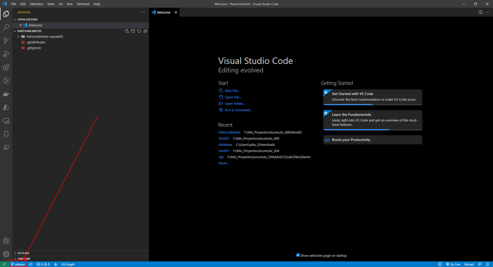
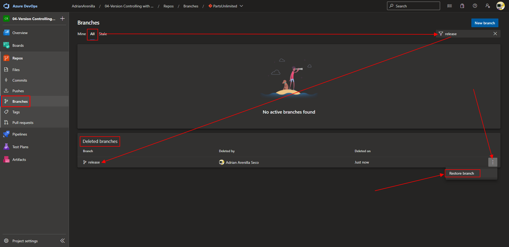

# Microsoft Az-400 (Adrián Arenilla Seco)

## Lab 04: Version Controlling with Git in Azure Repos
In this lab, you will learn how to work with branches and repositories in Azure DevOps.

### [Go to lab instructions -->](AZ400_M04_Version_Controlling_with_Git_in_Azure_Repos.md)


Project created successfully.


Store the credentials in Git.
```
git config --global credential.helper wincred
```
See if we already have the credentials.
```
git config --list
```


Clone the repository to VSCode.


Successfully cloned repository.


Create a new branch into Azure DevOps portal.


Create a new branch into Azure DevOps portal.


New branch created.


Branch change within VS Code.


Changed branch.



Delete branch into Azure DevOps portal.


Delete branch into Azure DevOps portal.


Restore branch into Azure DevOps portal.



Block master branch.


Lock master branch.


Unlock master branch.


Create a tag into Azure DevOps portal.


Tag created.


Create a repository into Azure DevOps portal.


Repository created.


Delete the previously created repository.


Delete the previously created repository.


### [<-- Back to readme](../README.md)

