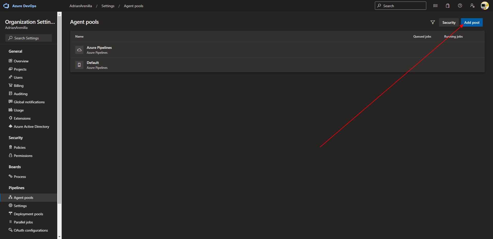

# Microsoft Az-400 (Adrián Arenilla Seco)

## Lab 05: Configuring Agent Pools and Understanding Pipeline Styles
In this lab, you will step through the process of converting a classic pipeline into a YAML-based one and running it first by using a Microsoft-hosted agent and then performing the equivalent task by using a self-hosted agent.

### [Go to lab instructions -->](AZ400_M05_Configuring_Agent_Pools_and_Understanding_Pipeline_Styles.md)

Project created successfully.

Create new pipeline.

New pipeline created.

Go to Edit option into PartsUnlimitedE2E.yml

Uncheck the "Enable continuous integration" box.

Inside PartsUnlimitedE2E.yml go to options to export to .yml

Go to PartsUnlimitedE2E.yml options to edit.

Replace the old code.

Paste the new code.

Check that the job is completed correctly.

Go to Azure DevOps organization to enter Personal access tokens option.

Create a new personal access token.

Add agent pool.

Add agent pool.

Into agent poll create a new agent.

Open PowerShell Administrator into the folder and execute the script "config.cmd".

Verify that the new agent is online.

Edit the code so that it displays like the image.

Edit the .yml file and modify Nuget settings.

Verify that the file has been modified correctly.

Check that the job is completed correctly.

Pipeline correctly executed.

### [<-- Back to readme](../README.md)

