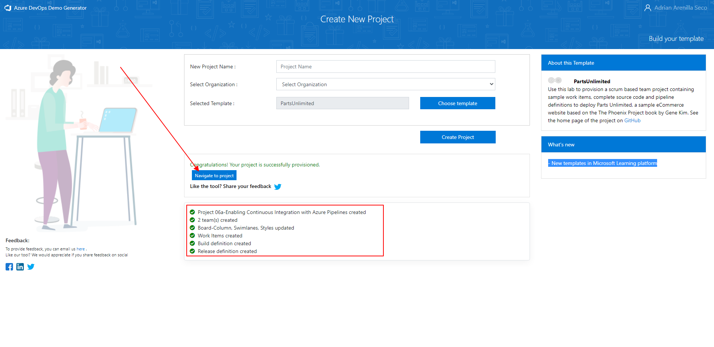
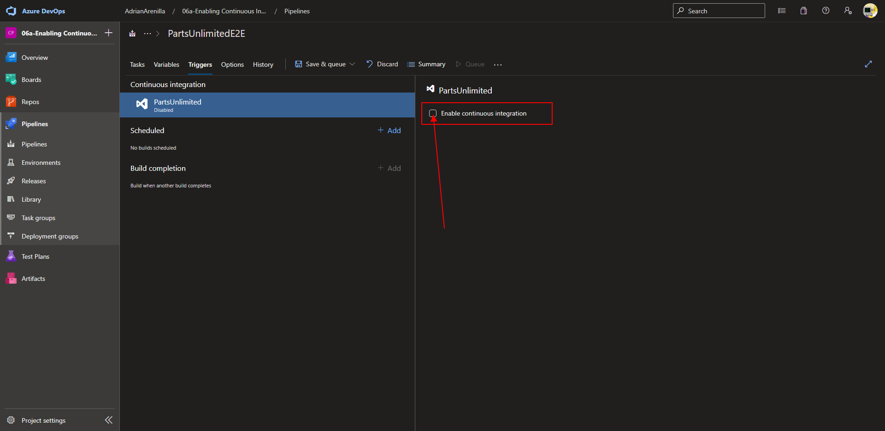
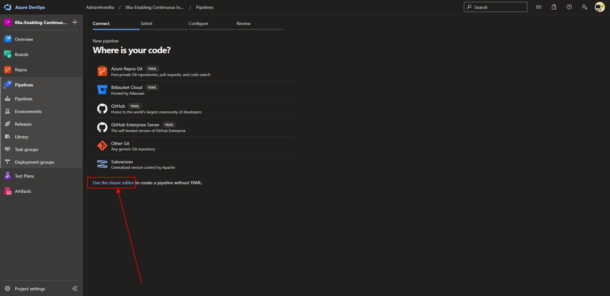
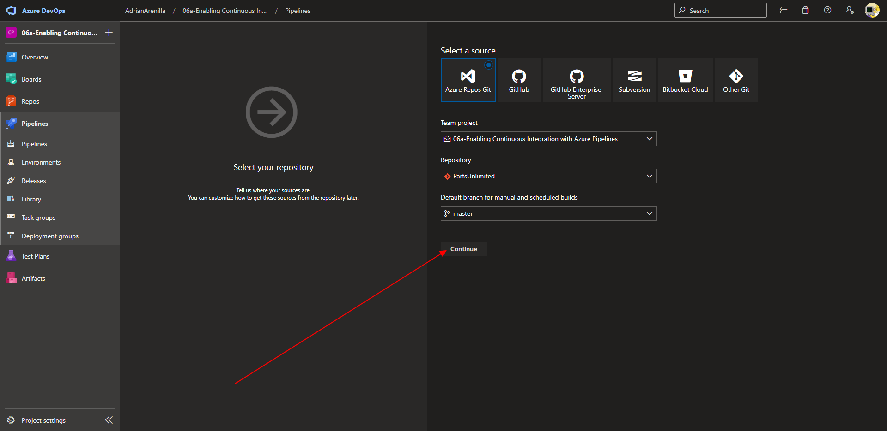
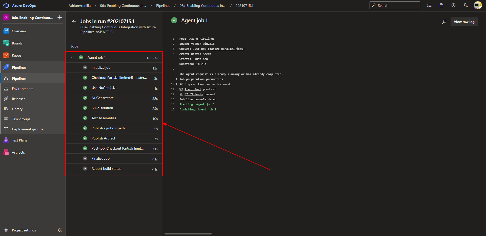
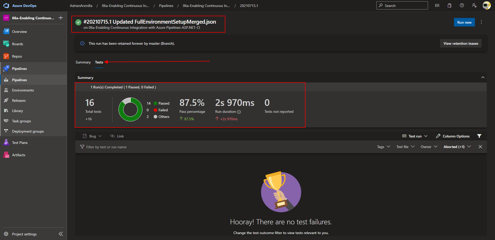
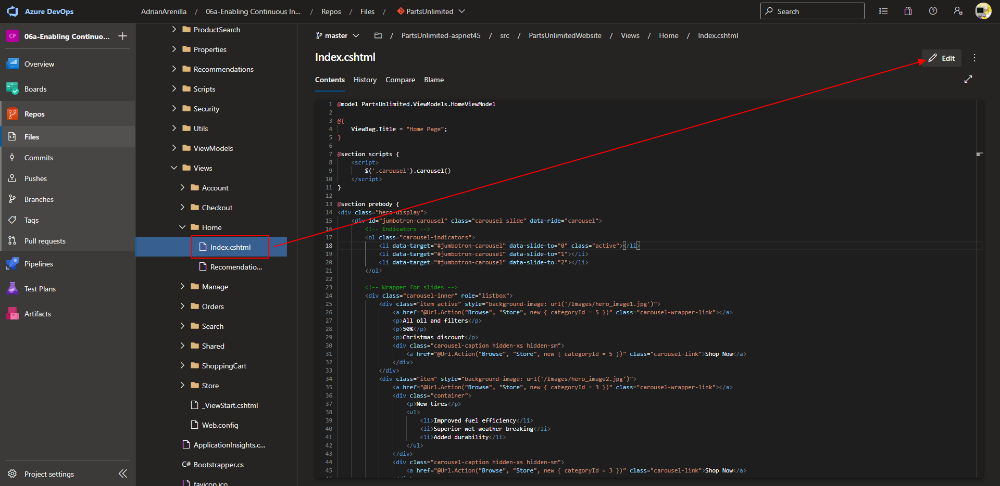
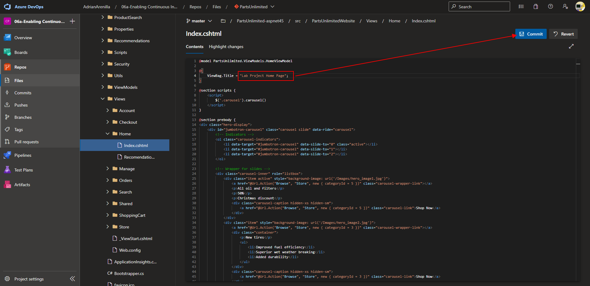
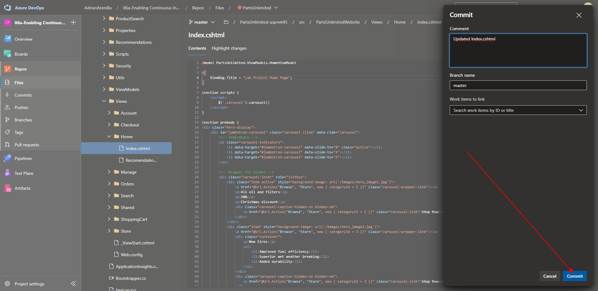
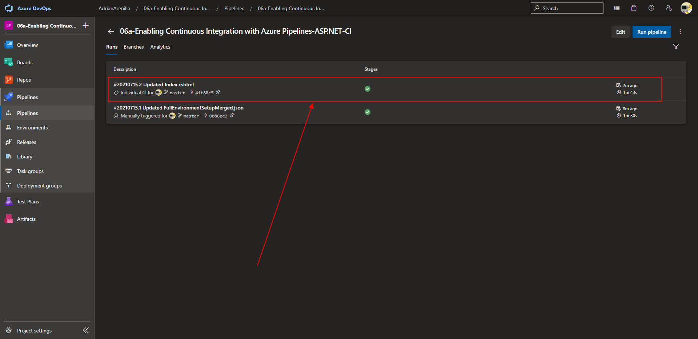

# Microsoft Az-400 (Adrián Arenilla Seco)

## Lab 06A: Enabling Continuous Integration with Azure Pipelines
In this lab, you will learn how to configure continuous integration (CI) and continuous deployment (CD) for your applications using Build and Release in Azure Pipelines. This scriptable CI/CD system is both web-based and cross-platform, while also providing a modern interface for visualizing sophisticated workflows. Although we won’t demonstrate all of the cross-platform possibilities in this lab, it is important to point out that you can also build for iOS, Android, Java (using Ant, Maven, or Gradle) and Linux.

### [Go to lab instructions -->](AZ400_M06_Enabling_Continuous_Integration_with_Azure_Pipelines.md)

Project created successfully.

Uncheck the "Enable continuous integration" box.

Go to "Use the classic editor" option.

Ensure that the Azure Repos Git option with the PartsUnlimited repository and master branch entries are selected.

Check that the job is completed correctly. 

Review tests for this build.

Go to "Index.cshtml" file and edit.

Update the text and commit.

Confirm commit.

Check that the job is completed correctly. 

### [<-- Back to readme](../README.md)

