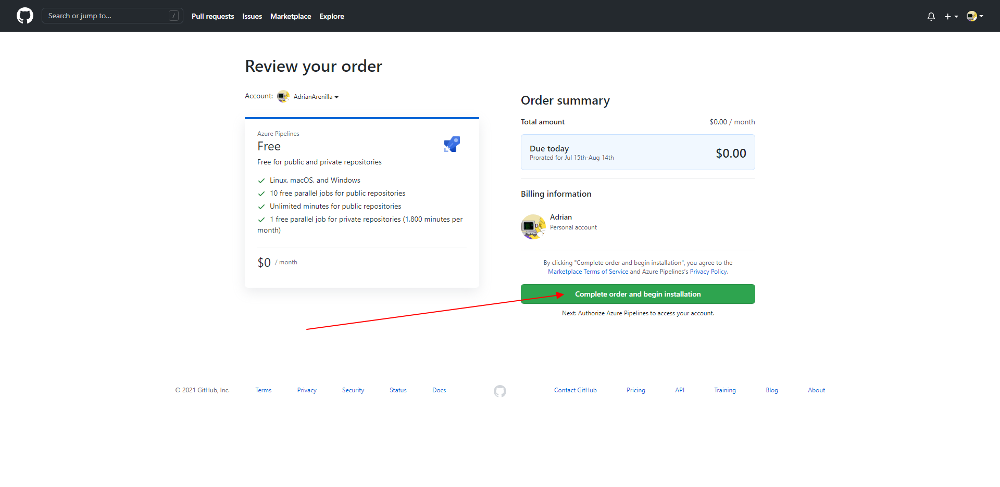
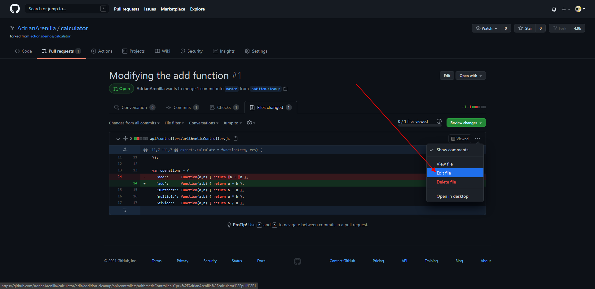

# Microsoft Az-400 (Adrián Arenilla Seco)

## Lab 06B: Integrating External Source Control with Azure Pipelines
In this lab, you’ll see how easy it is to set up Azure Pipelines with your GitHub projects and how you can start seeing benefits immediately.

### [Go to lab instructions -->](AZ400_M06_Integrating_External_Source_Control_with_Azure_Pipelines.md)

Install Azure Pipelines on GitHub.

Complete the installation.

Install Azure Pipelines in all repositories.

Grant permissions.

Configure the Azure Pipelines project based on the fork of the GitHub repo.

ERROR!!

The project is now private and the job is completed correctly. 

Project public vs. project private errors.

Change visibility for errors.

GitHub project repo hosting the fork.

Modification of the file "azure-pipelines.yml".

Check that the job is completed correctly. 

Modification of the file "arithmeticController.js".

Error into the code.

Error into the job in Azure DevOps portal.

The error indicates that in the test the numbers are concatenated instead of being added.

Edit the file to solve the error.

Modification of the file "arithmeticController.js".

The new code is correct.

Check that the job is completed correctly. 

Add badge to the file "readme.md"

Badge added successfully.

### [<-- Back to readme](../README.md)

