# Microsoft Az-400 (Adrián Arenilla Seco)

## Lab 07: Integrating Azure Key Vault with Azure DevOps
In this lab, you will learn how you can integrate Azure Key Vault with an Azure DevOps pipeline.

### [Go to lab instructions -->](AZ400_M07_Integrating_Azure_Key_Vault_with_Azure_DevOps.md)


Project created successfully.
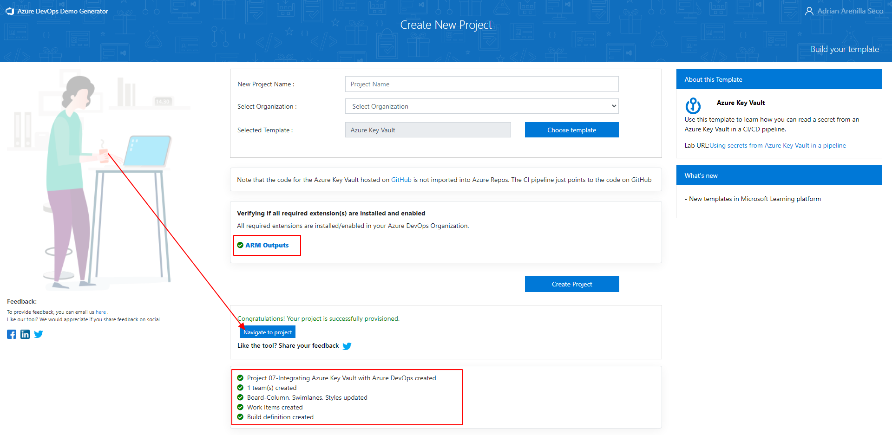


Run the following command to create a service principal:
```
az ad sp create-for-rbac --name <service-principal-name>
```

Run the following commands to retrieve the values of the Azure subscription ID and subscription name attributes: 
```
az account show --query id --output tsv
az account show --query name --output tsv
```
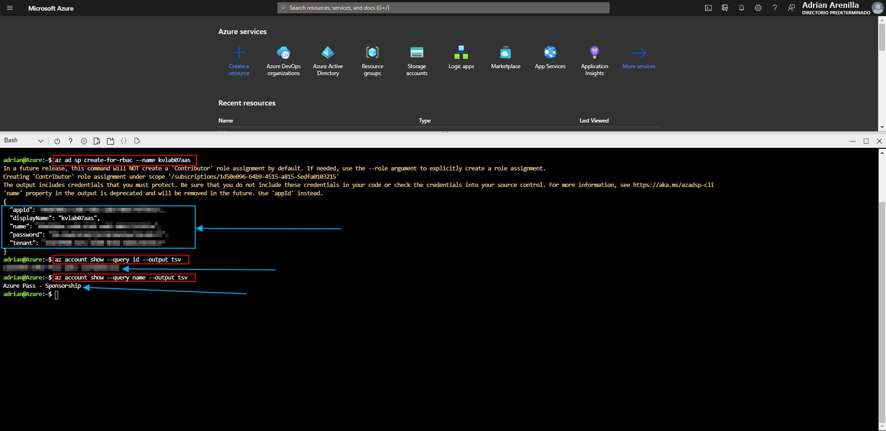


Key vault created.
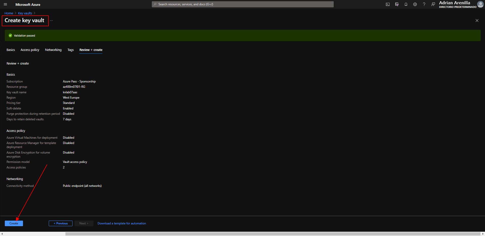


Create a new policy on key vault.
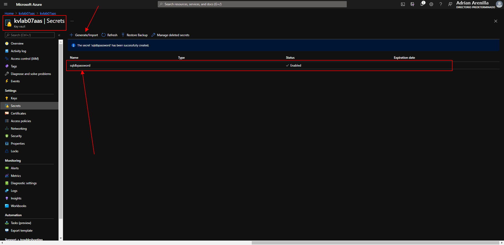


Run pipeline SmartHotel-CouponManagement-CI.
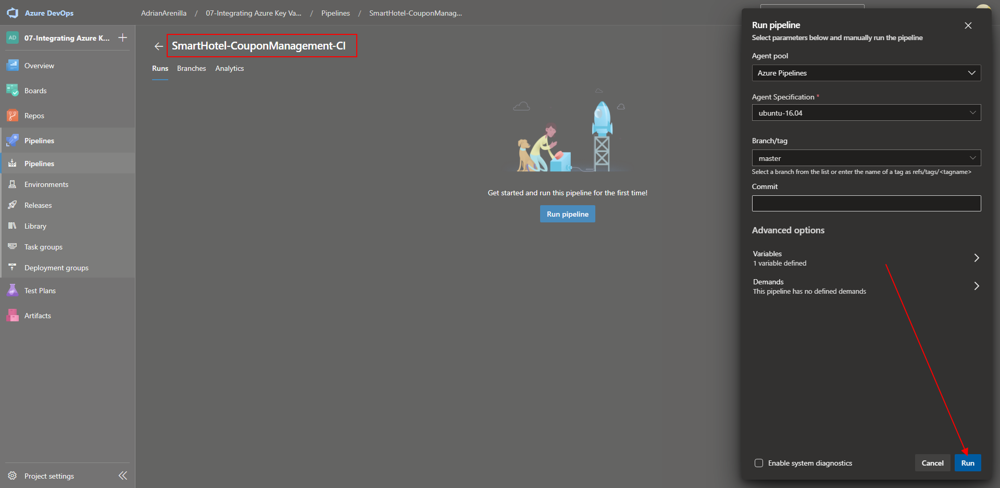


Edit SmartHotel-CouponManagement-CD.
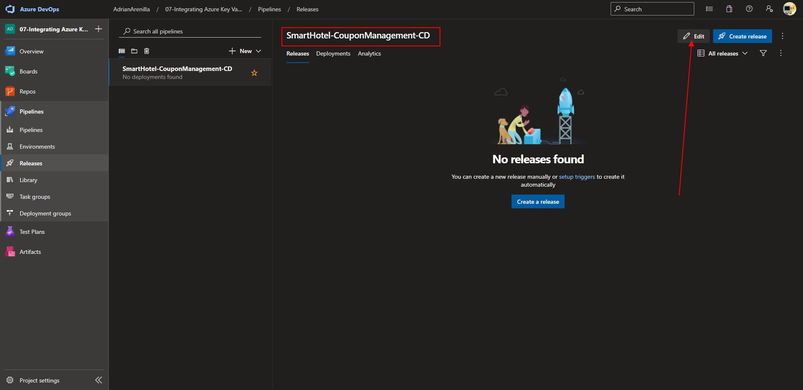


Create a new connection service.
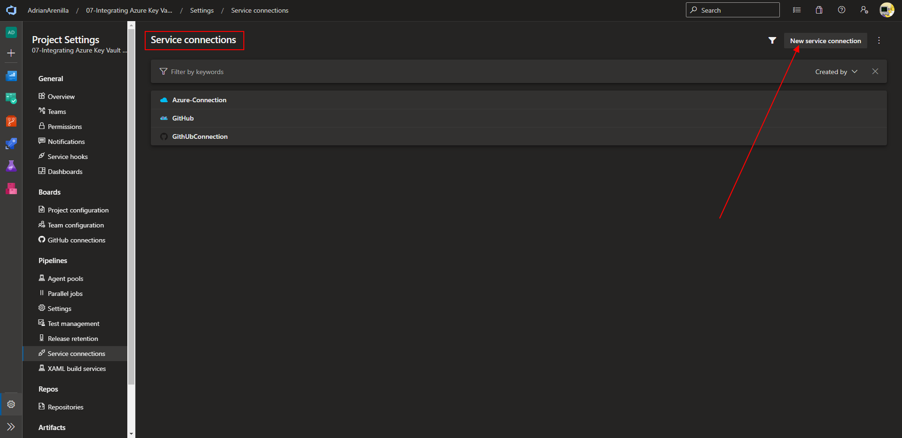


Complete and verify the required lab fields.
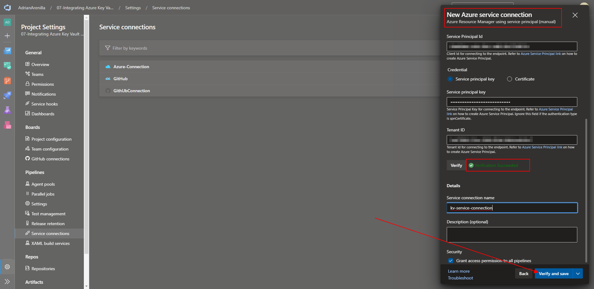


Verify that Azure Key Vault is correct.
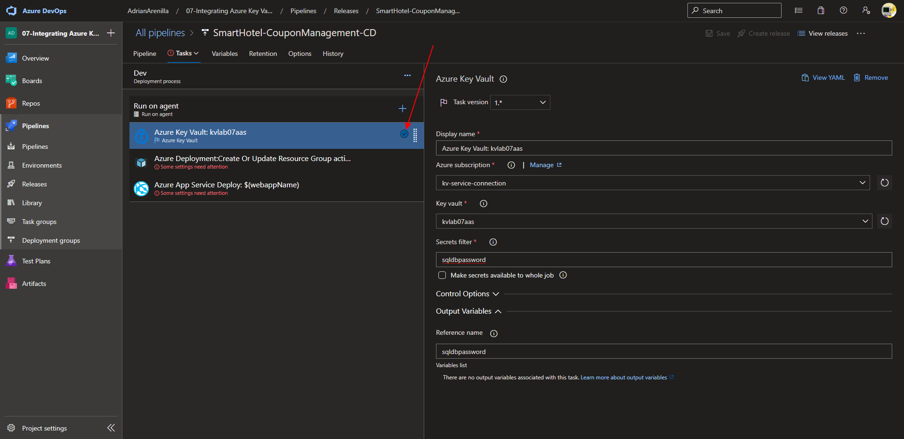


Verify that Azure Deployment is correct.
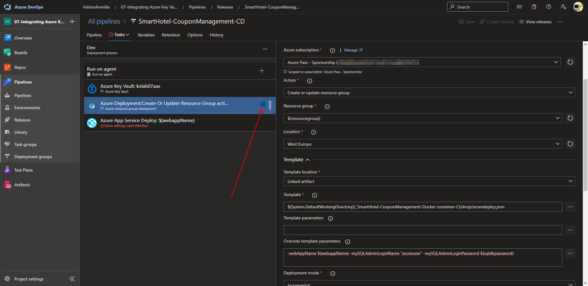


Verify that Azure App Service Deploy is correct and save.


Create new release.
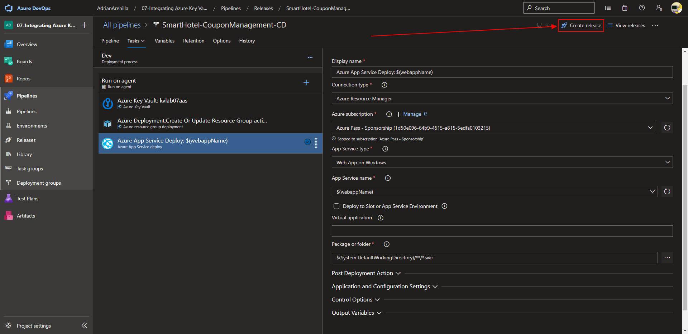


If everything is correct, click on Create.
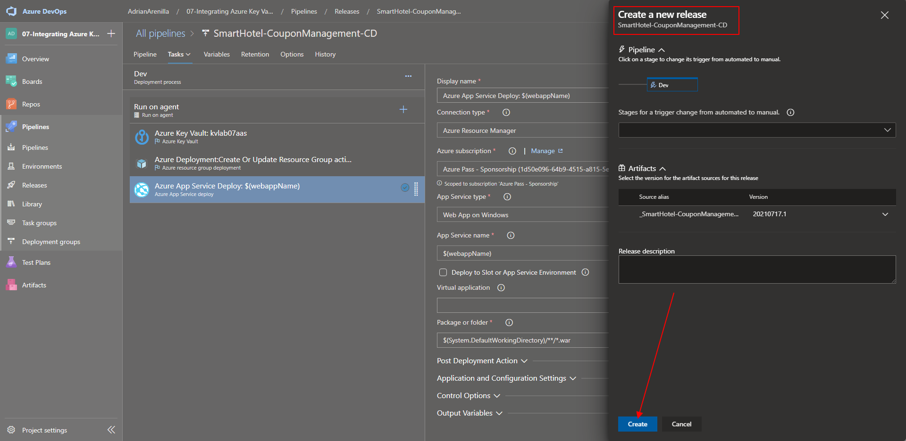


Make sure your pipeline runs successfully and has finished.
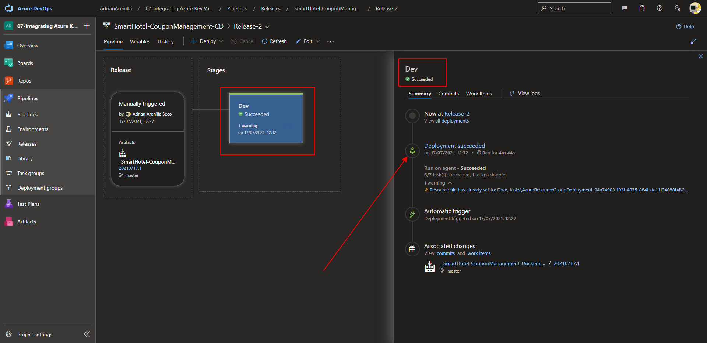


Make sure your pipeline runs successfully and has finished.
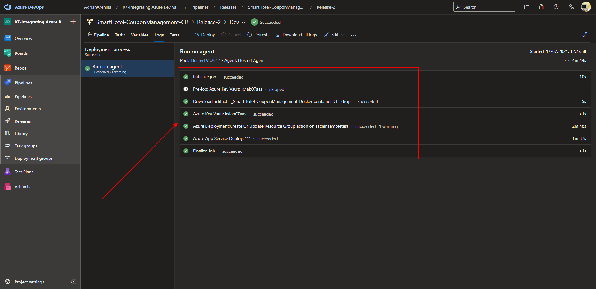


Verify the resources within the resource group.
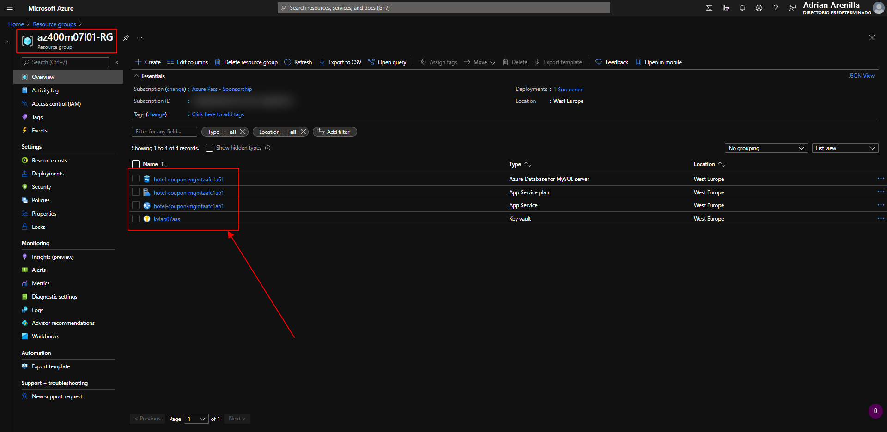


Login to the website.
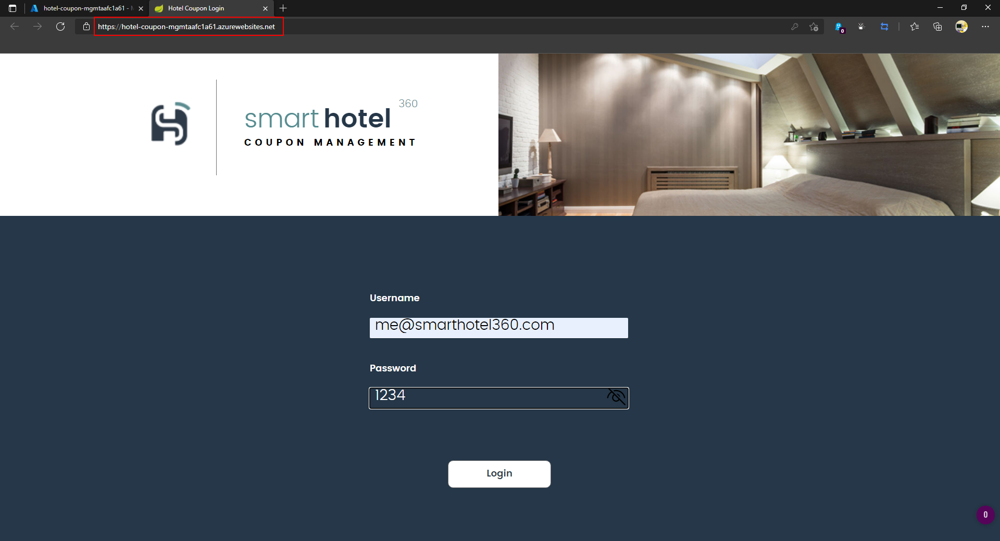


Test any coupon to verify operation.
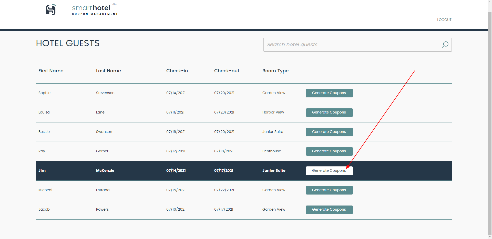


See the results.
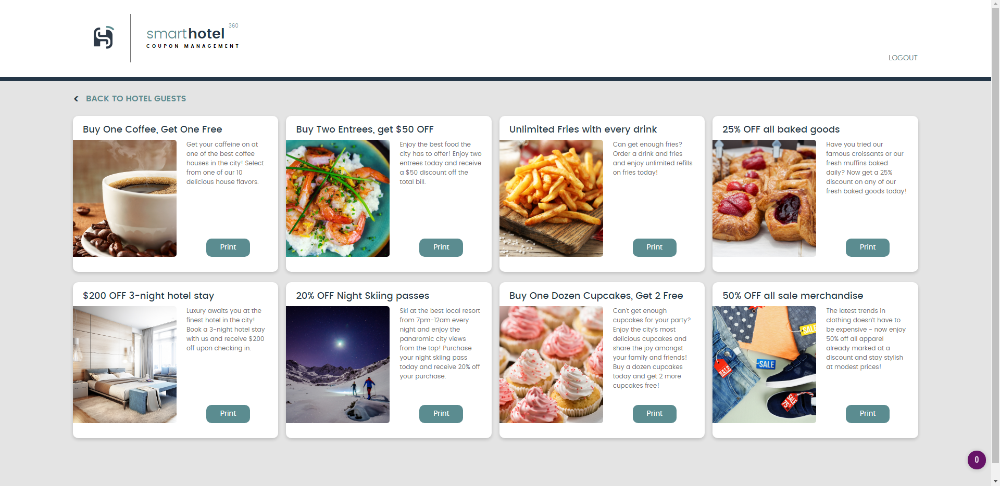


List the resource groups created in the lab for this module by running the following command:
```
az group list --query "[?starts_with(name,'az400m07l01-RG')].name" --output tsv
```

Delete the resource groups that you created in the lab for this module by executing the following command:
```
az group list --query "[?starts_with(name,'az400m07l01-RG')].[name]" --output tsv | xargs -L1 bash -c 'az group delete --name $0 --no-wait --yes'
```
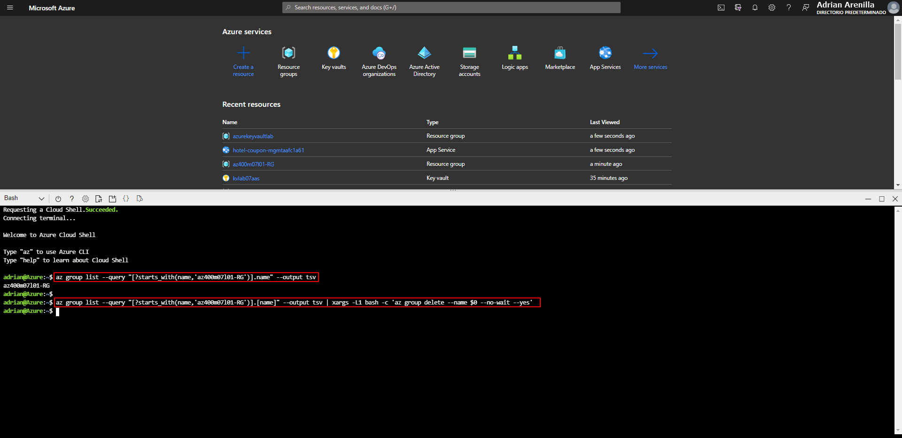


### [<-- Back to readme](../README.md)

