# Microsoft Az-400 (Adrián Arenilla Seco)

## Lab 08: Implementing GitHub Actions by using DevOps Starter
In this lab, you will learn how to implement a GitHub Action workflow that deploys an Azure web app by using DevOps Starter.

### [Go to lab instructions -->](AZ400_M08_Implementing_GitHub_Actions_by_using_DevOps_Starter.md)


Create DevOps Starter project.
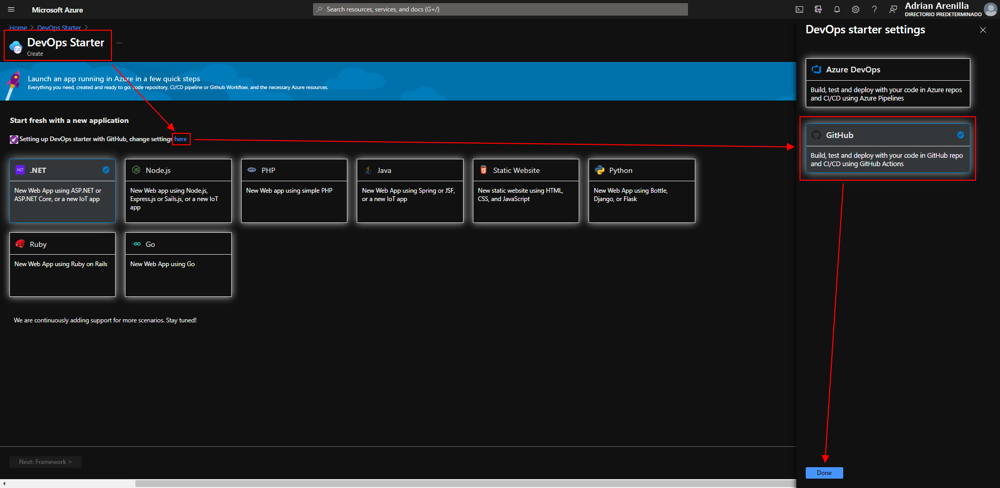


Choose the ASP.NET Core tile.
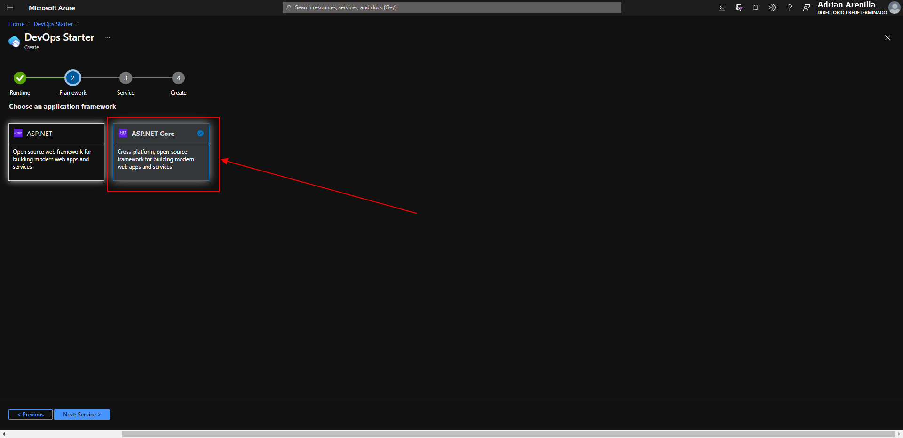


Ensure that the Windows Web App tile is selected.
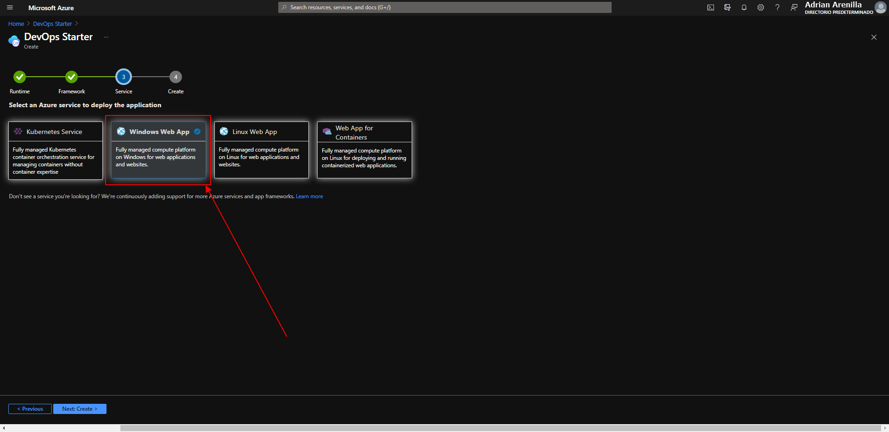


Authorize Azure GitHub Actions pop-up web browser window.
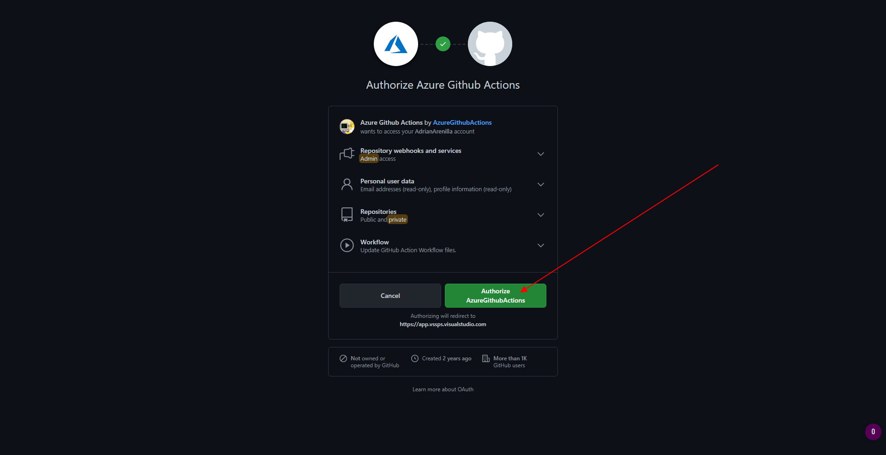


Go to the resource when the project is successfully created.
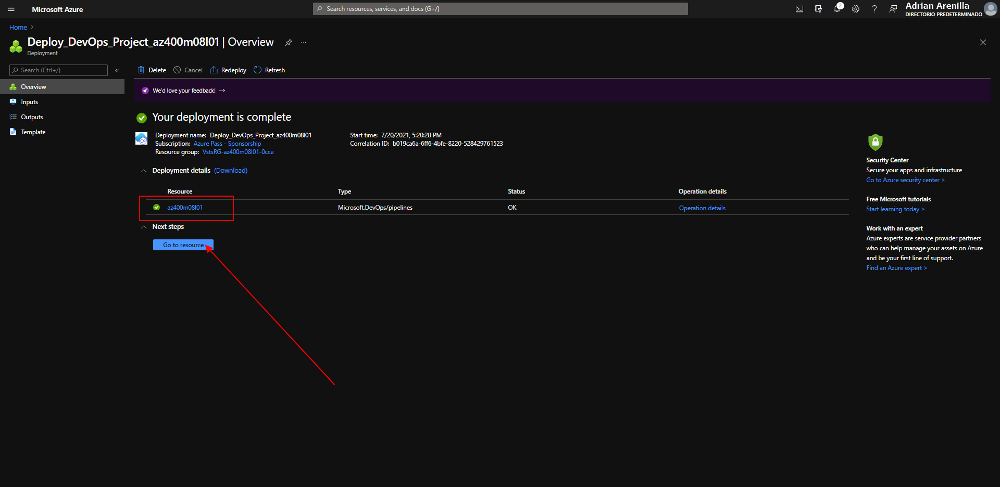


On the az400m08l01 blade, on the GitHub Workflow tile, click Authorize.
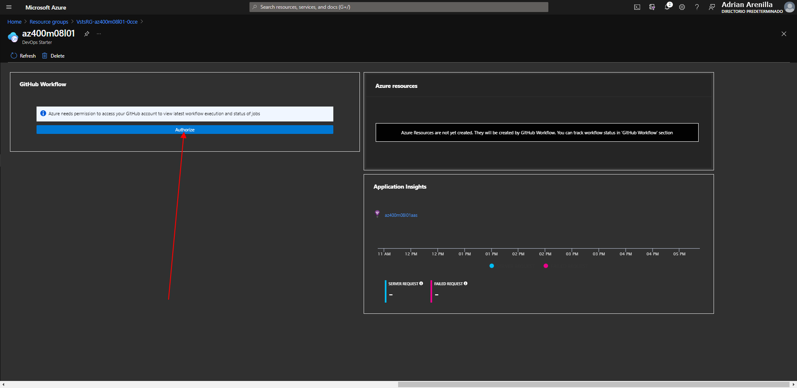


Review the GitHub Workflow section and verify that the build, deploy, and Functional tests jobs completed successfully.
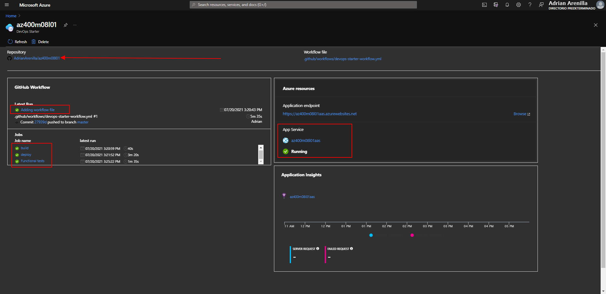


Change the line 19 to `<div class="description line-1"> GitHub Workflow has been successfully updated (Your Name)</div>` and click Commit changes.
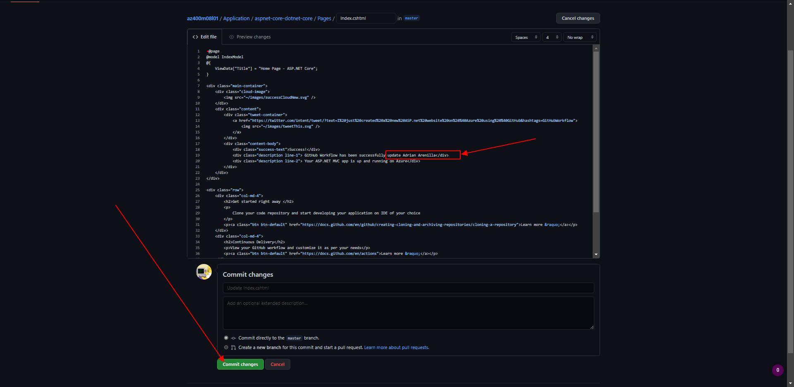


In the devops-starter-workflow.yml section, monitor the progress of deployment and verify that it completed successfully.
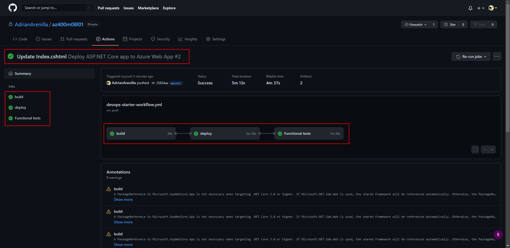


Switch to the browser window displaying the DevOps Starter blade in the Azure portal and click the Browse link next to the Application endpoint entry.
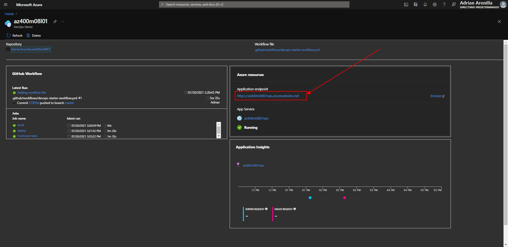


Verify that the updated text representing the change you committed in the GitHub repo is displayed on the web app home page.
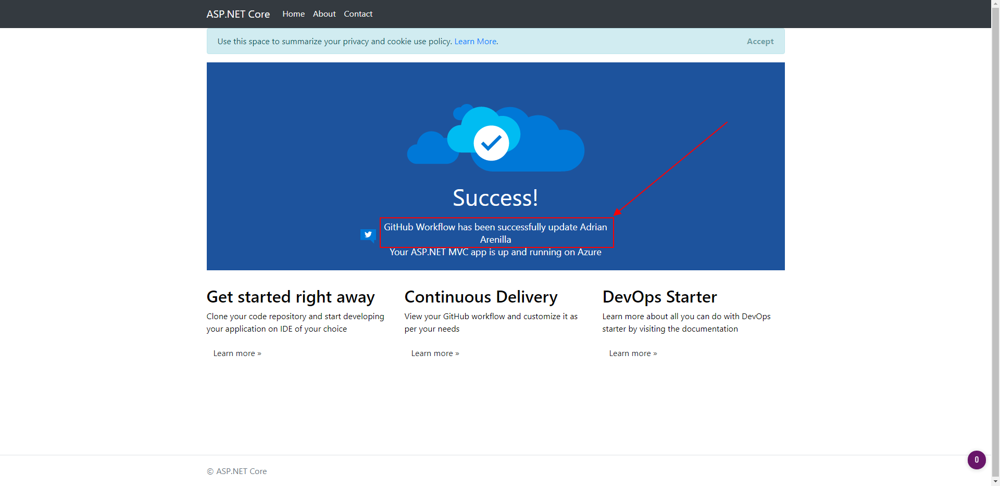


Activate Application Insight to check project telemetry.
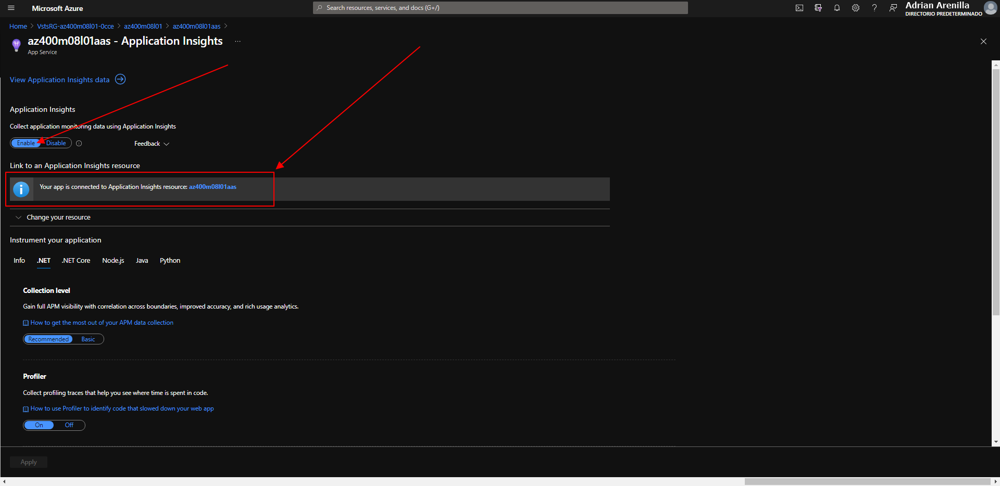


Verify that there are requests from the server.
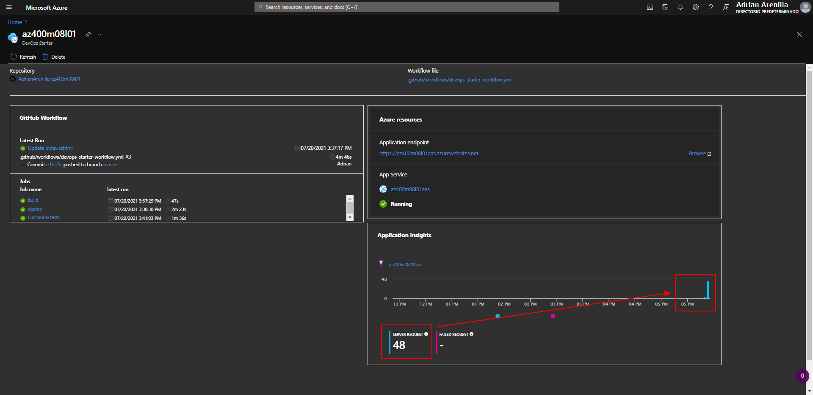


List the resource groups created in the lab for this module by running the following command:
```
az group list --query "[?starts_with(name,'az400m08l01')].name" --output tsv
```

Delete the resource groups that you created in the lab for this module by executing the following command:
```
az group list --query "[?starts_with(name,'az400m08l01')].[name]" --output tsv | xargs -L1 bash -c 'az group delete --name $0 --no-wait --yes'
```

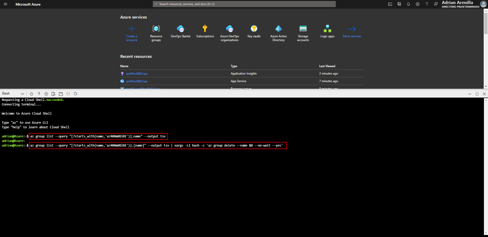


### [<-- Back to readme](../README.md)

