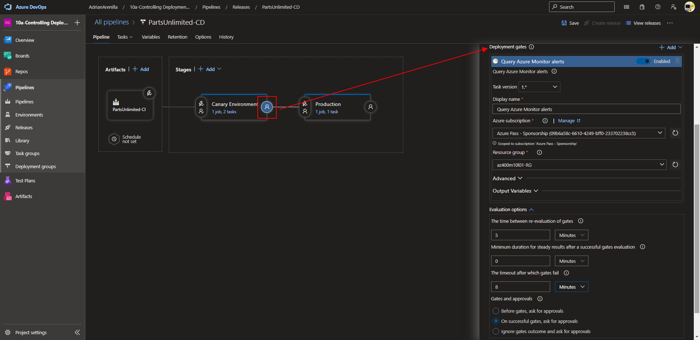

# Microsoft Az-400 (Adrián Arenilla Seco)

## Lab 10A: Controlling Deployments using Release Gates
In this lab, you will learn about configuring Azure deployment gates.

### [Go to lab instructions -->](AZ400_M10_Controlling_Deployments_using_Release_Gates.md)


Project created successfully.


Run the following command to create a resource group.
```
RESOURCEGROUPNAME="az400m10l01-RG"
az group create -n $RESOURCEGROUPNAME -l "<westeurope>""
```


To create an App service plan.
```
SERVICEPLANNAME="az400m01l01-sp1"
az appservice plan create -g $RESOURCEGROUPNAME -n $SERVICEPLANNAME --sku S1
```


Create web apps with unique app names.
```
SUFFIX=$RANDOM$RANDOM
az webapp create -g $RESOURCEGROUPNAME -p $SERVICEPLANNAME -n PU$SUFFIX-Canary
```


Create web apps with unique app names.
```
az webapp create -g $RESOURCEGROUPNAME -p $SERVICEPLANNAME -n PU$SUFFIX-Prod
```


Navigate to the resource group az400m10l01-RG and review the resources you created.


On the Application Insights blade, click Turn on Application Insights, accept the default settings, and click Apply to create and connect Application Insights resource to your Canary web app.


Create alert rule blade, in the Condition section.


Create alert rule blade, in the Condition section.


On the Pipeline tab, in the Artifacts rectangle, click the Continuous deployment trigger button.


Update the data of the Canary environment pipeline.


Update the data of the Production environment pipeline.


Run pipeline.


Verify that the pipeline has been done correctly (CI).


Track the progress of the release and verify that the deployment to both web apps completed successfully.


Verify that the web page loads successfully (Canary environment).


Verify that the web page loads successfully (Production environment).


Configure pre-deployment gates.


Select the project name and set the Read permission to Allow.


Configure post-deployment gates.



If the result is Fail, wait for the next evaluation. 

This indicates that there are active work items. These work items need to be closed in order to proceed further. Next sampling time will be after 5 minutes.


We close the pending task and wait for the time for the next evaluation.


Once the evaluation is successful, you will see the request for pre-deployment approval.


Track the progress of the release and verify that the deployment to both web apps completed successfully.


Validate that failed requests were detected by Application Insights by navigating to the Application Insights blade of the Canary web app page.


List the resource groups created in the lab for this module by running the following command:
```
az group list --query "[?starts_with(name,'az400m10l01-RG')].name" --output tsv
```

Delete the resource groups that you created in the lab for this module by executing the following command:
```
az group list --query "[?starts_with(name,'az400m10l01-RG')].[name]" --output tsv | xargs -L1 bash -c 'az group delete --name $0 --no-wait --yes'
```


### [<-- Back to readme](../README.md)
