# Microsoft Az-400 (Adrián Arenilla Seco)

## Lab 10B: Creating a Release Dashboard
In this lab, you will learn how to create a release dashboard and use the REST API to retrieve release data from Azure DevOps.

### [Go to lab instructions -->](AZ400_M10_Creating_a_Release_Dashboard.md)


Create an Azure DevOps Starter resource.
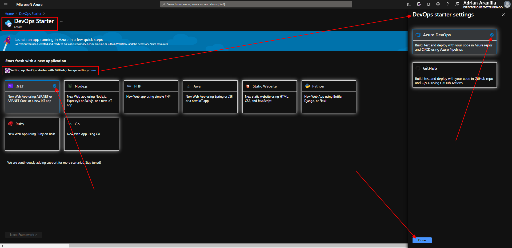


Create an Azure DevOps Starter resource.
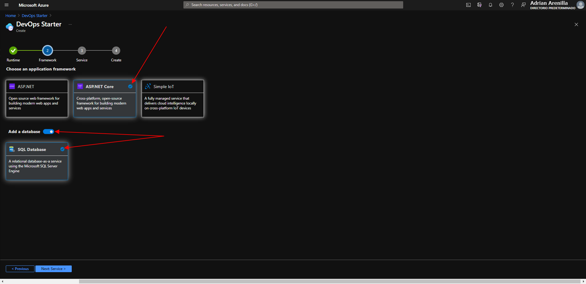


Create an Azure DevOps Starter resource.
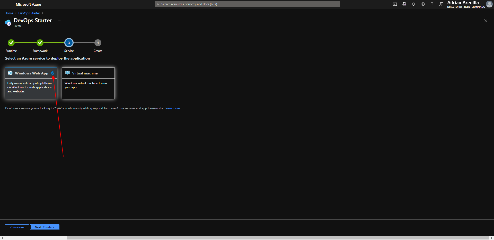


Create an Azure DevOps Starter resource.
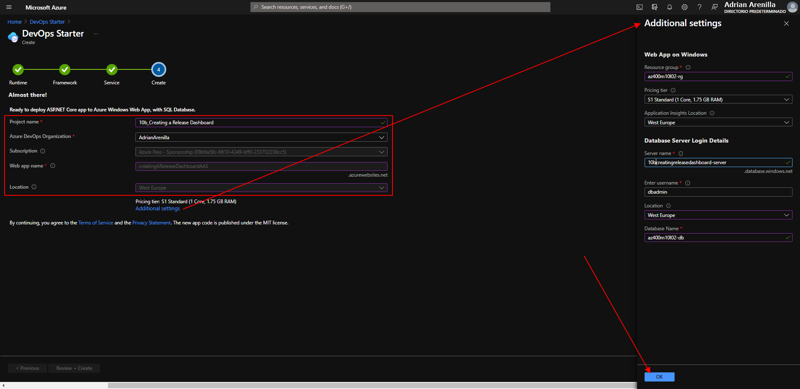


On the DevOps Starter blade, track the progress of CI/CD pipeline until it completes successfully.
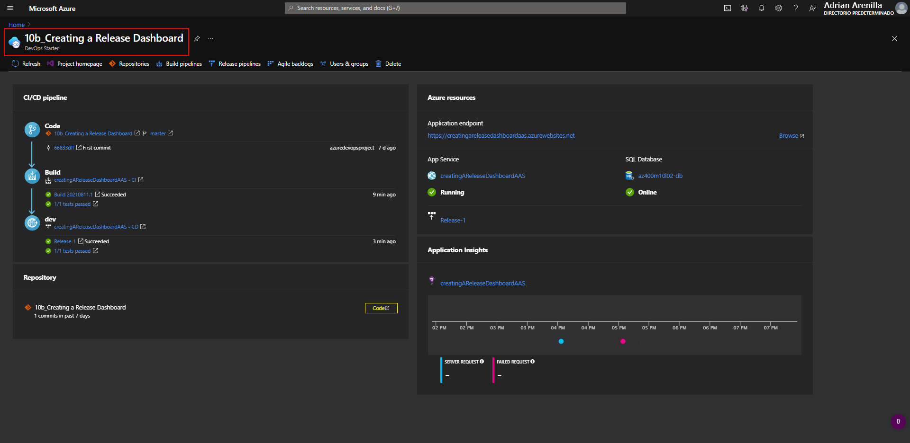


Edit the file Index.cshtml and Commit the changes.
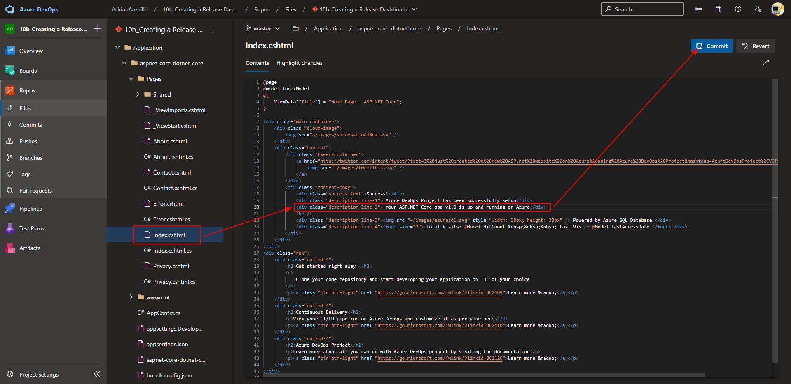


Make sure your pipeline runs successfully and has finished.
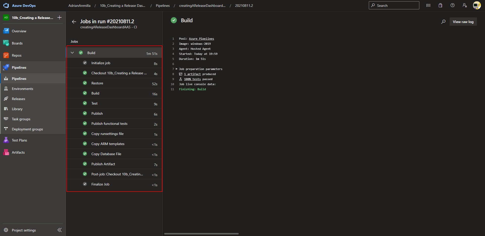


Make sure your pipeline runs successfully and has finished.
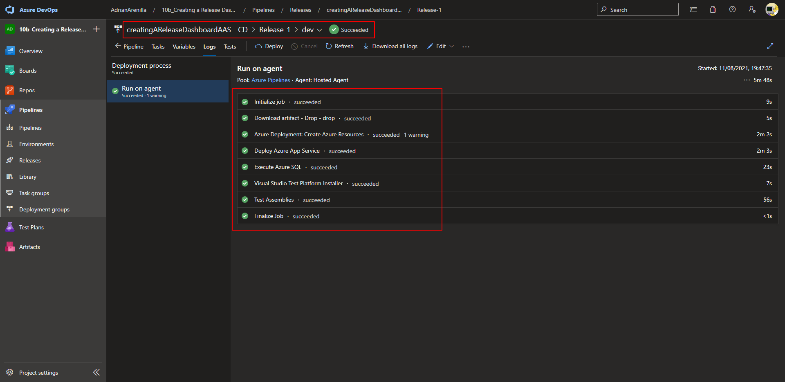


Edit the file Index.cshtml and Commit the changes.
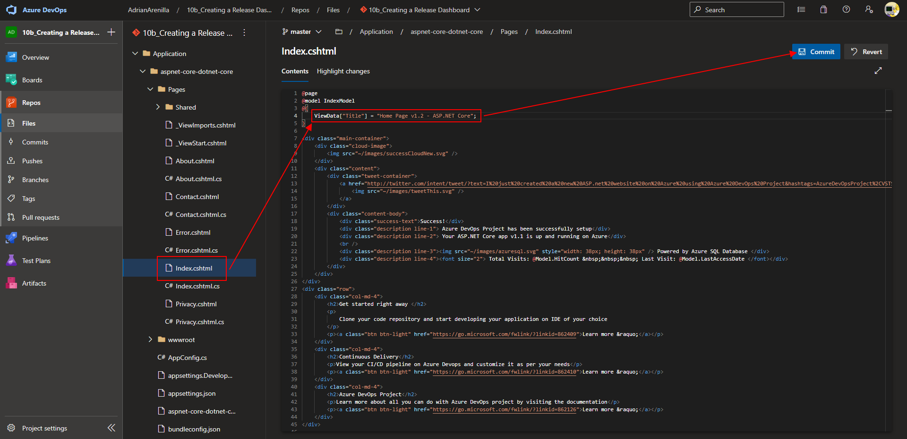


Now, the pipeline will fail. The failure will be caused by the built-in assembly test, which considers the change associated with the new version to be invalid.
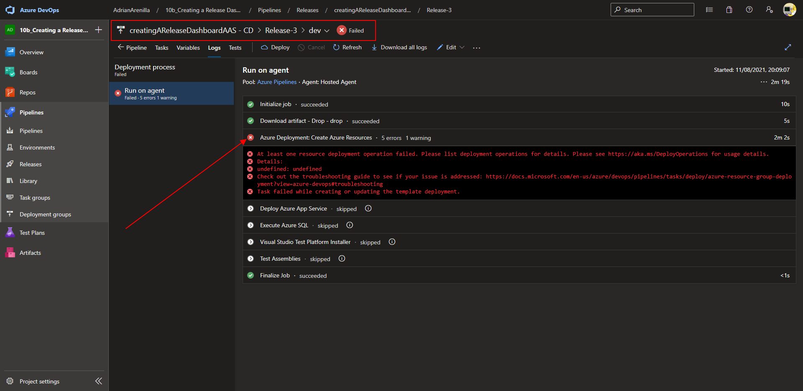


Create an Azure DevOps release dashboard.
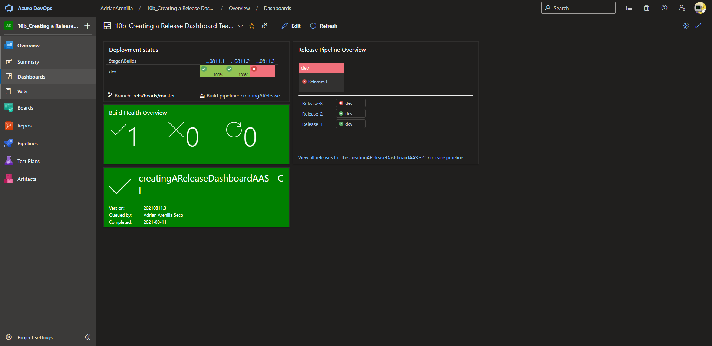


Generate an Azure DevOps personal access token.
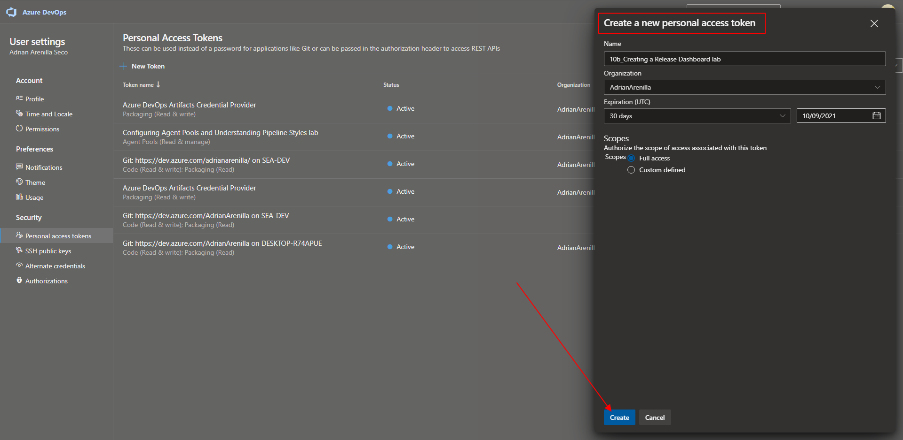


Query release information via REST API by using Postman.
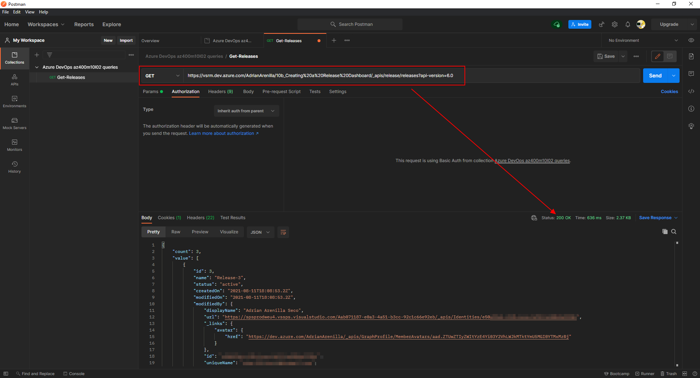


Query release information via REST API by using Postman.
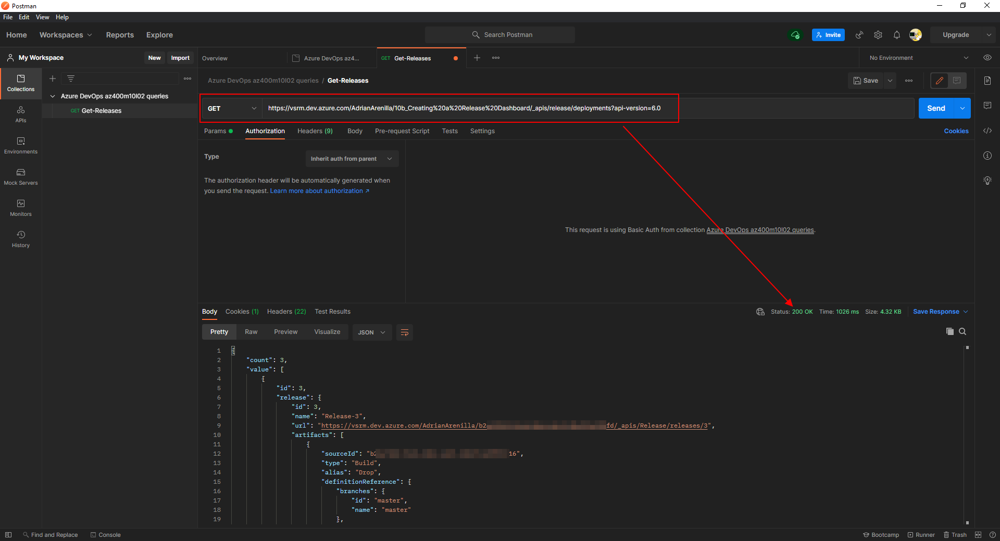


Query release information via REST API by using Postman.
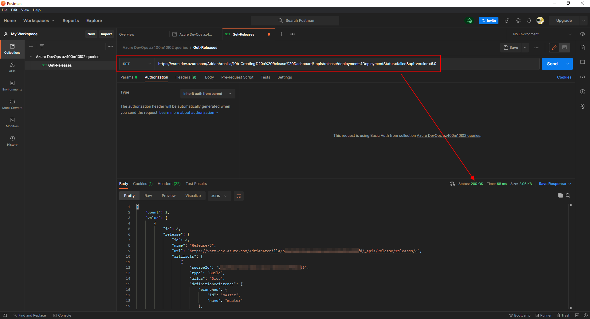


On the DevOps Starter blade, track the progress of CI/CD.
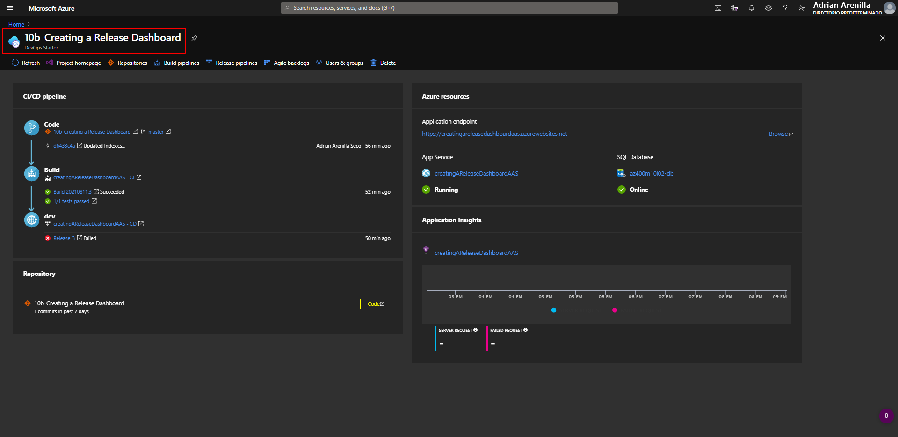


List the resource groups created in the lab for this module by running the following command:
```
az group list --query "[?starts_with(name,'az400m10l02-rg')].name" --output tsv
```

Delete the resource groups that you created in the lab for this module by executing the following command:
```
az group list --query "[?starts_with(name,'az400m10l02-rg')].[name]" --output tsv | xargs -L1 bash -c 'az group delete --name $0 --no-wait --yes'
```
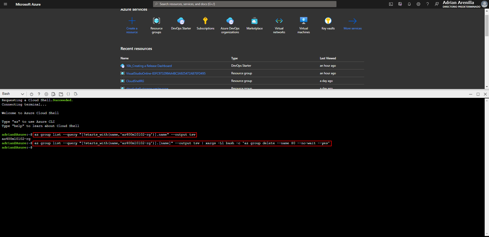


### [<-- Back to readme](../README.md)

