# Microsoft Az-400 (Adrián Arenilla Seco)

## Lab 11A: Configuring Pipelines as Code with YAML
In this lab, you will learn how to configure pipelines using YAML.

### [Go to lab instructions -->](AZ400_M11_Configuring_Pipelines_as_Code_with_YAML.md)


Project created successfully.
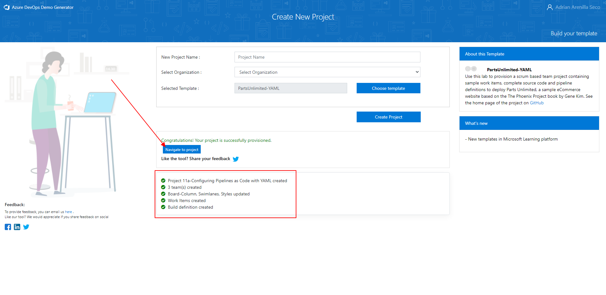


Create Web App + SQL resource.
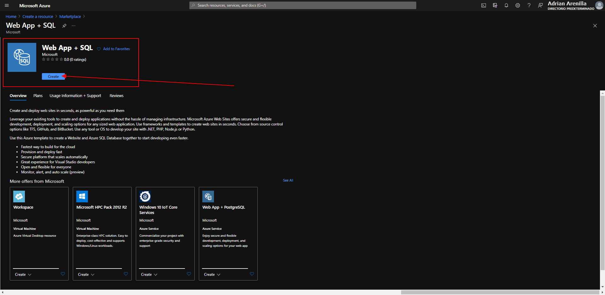


Create Web App + SQL resource.
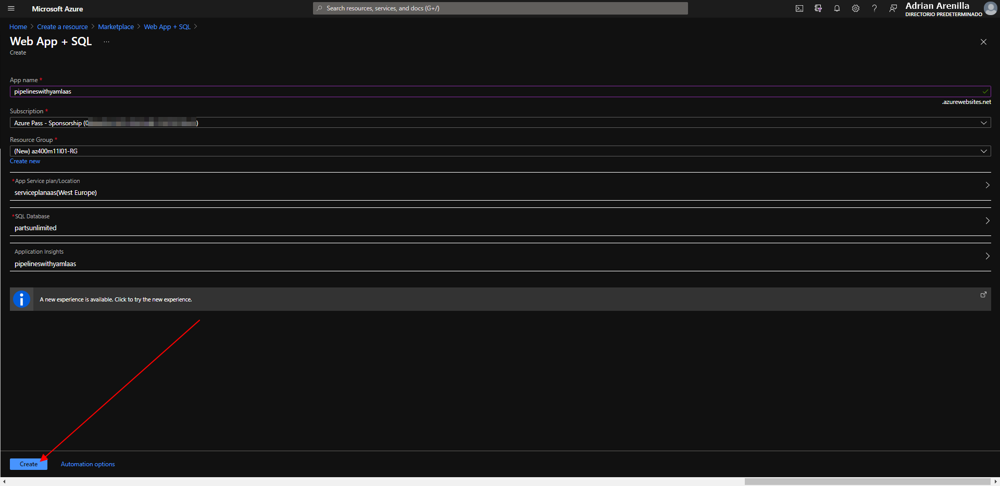


Delete PartsUnlimited pipeline.
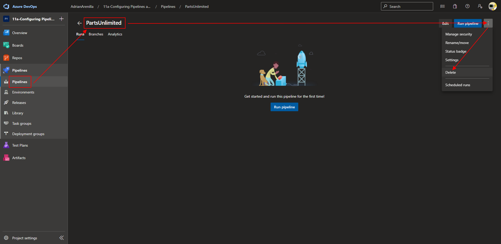


Delete the azure-pipelines.yml file.
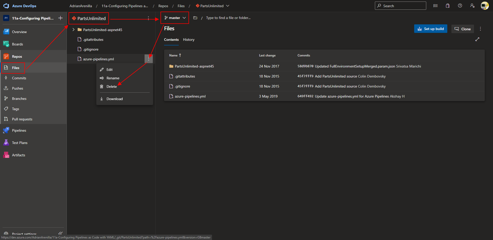


Create a new pipeline and update the azure-pipelines.yml file created.
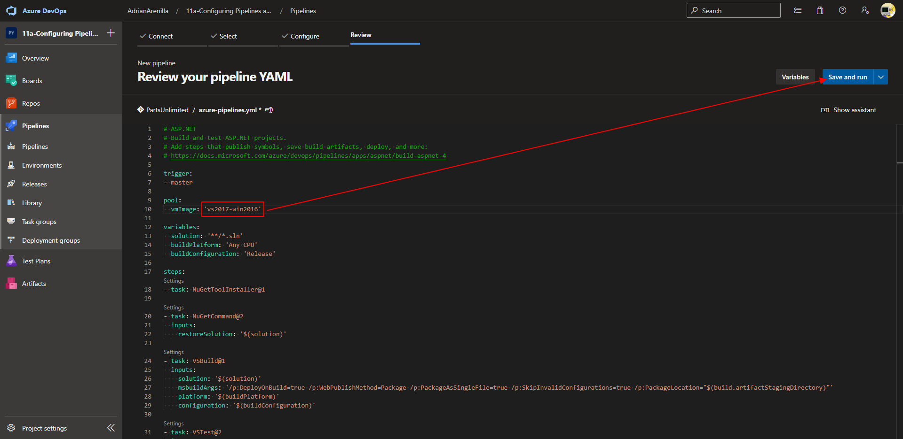


Monitor its progress and verify that it completes successfully.
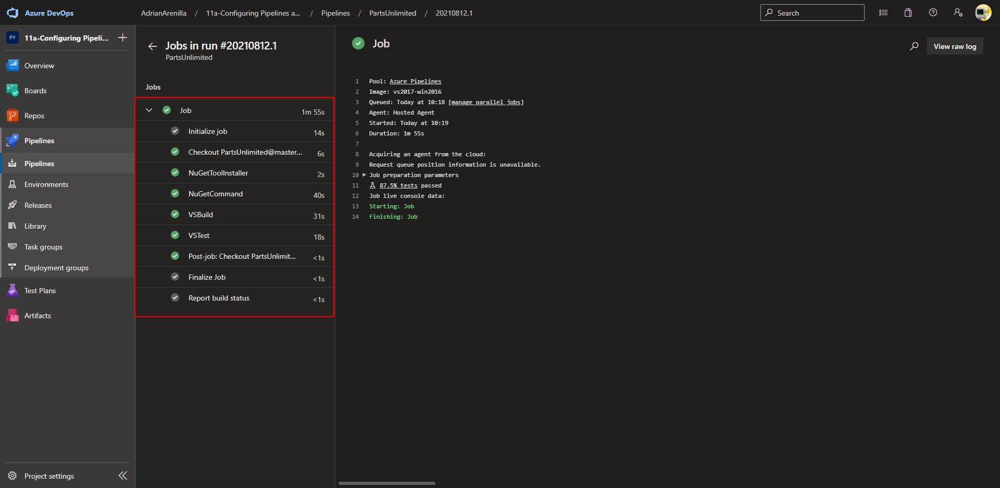


Review test statistics.
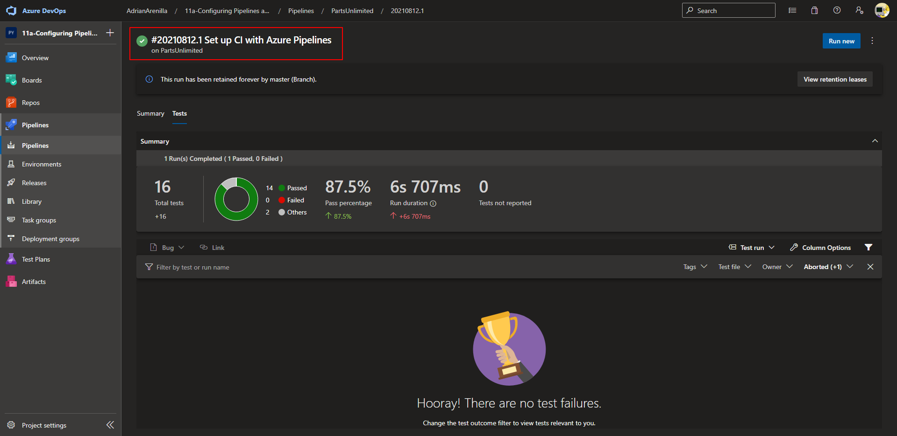


Add continuous delivery to the YAML definition.
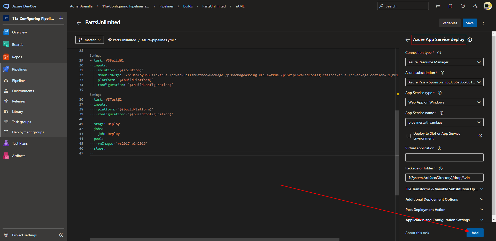


Azure app service deploy added to azure-pipelines.yml file.
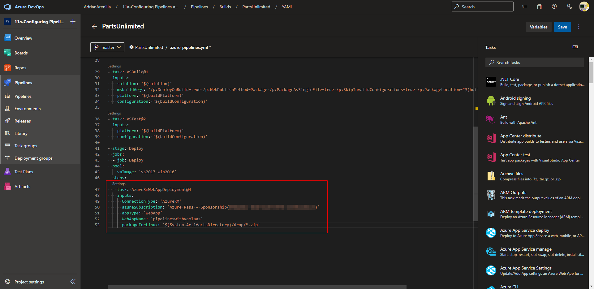


The pipeline will look similar to this example.
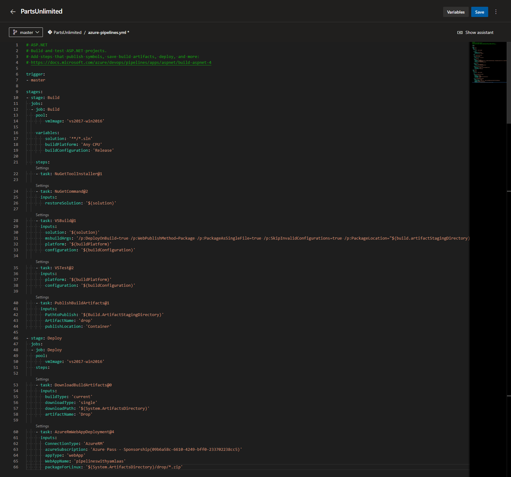


Allow access to the pipeline to access the requested resource.
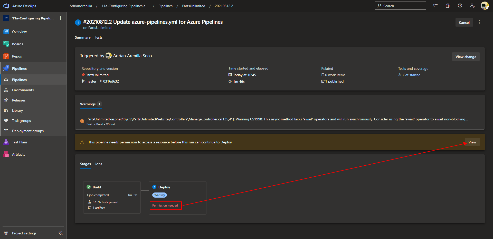


Click on Permit the access.
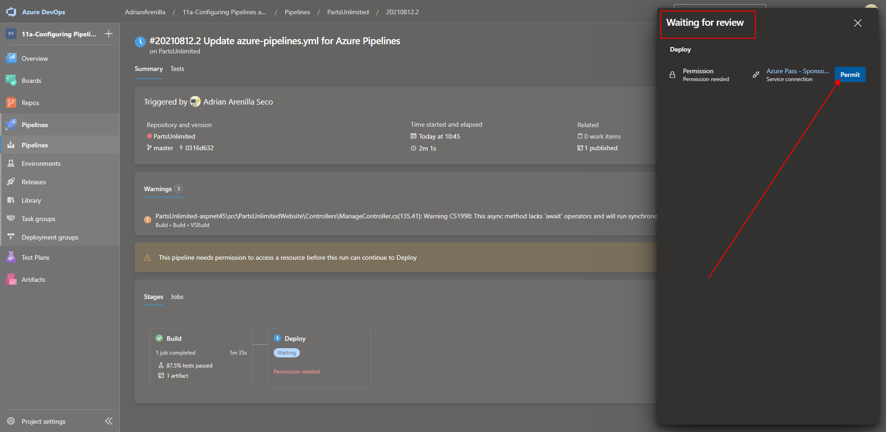


Once the task completes, your app will be deployed to an Azure web app.
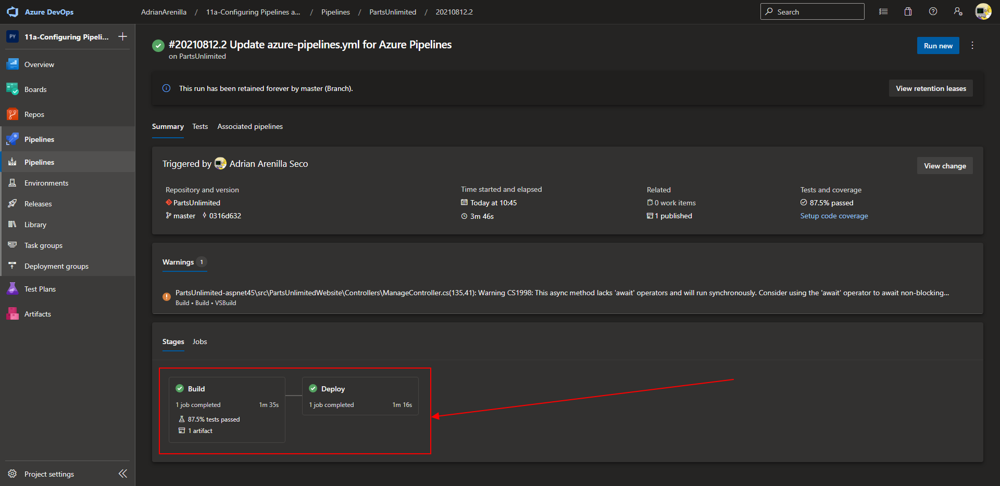


Edit the connection string in the Azure portal of the App Service.
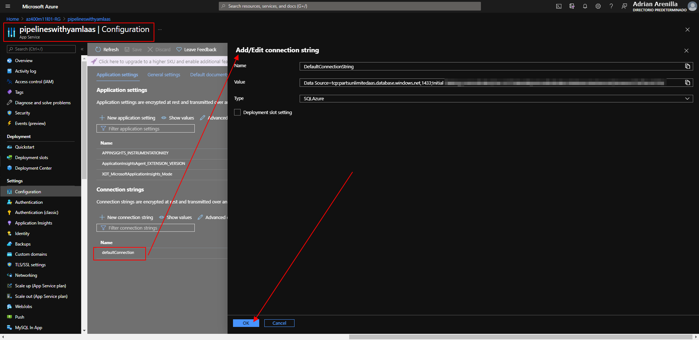


Review the deployed site.
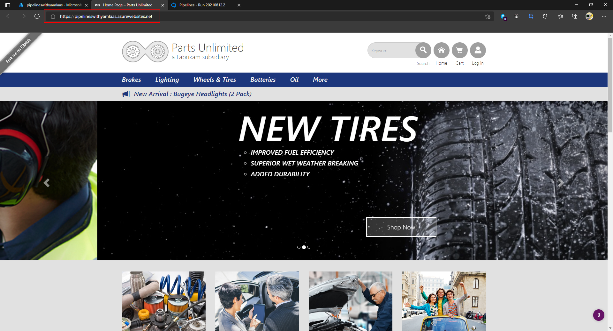


List the resource groups created in the lab for this module by running the following command:
```
az group list --query "[?starts_with(name,'az400m11l01-RG')].name" --output tsv
```

Delete the resource groups that you created in the lab for this module by executing the following command:
```
az group list --query "[?starts_with(name,'az400m11l01-RG')].[name]" --output tsv | xargs -L1 bash -c 'az group delete --name $0 --no-wait --yes'
```
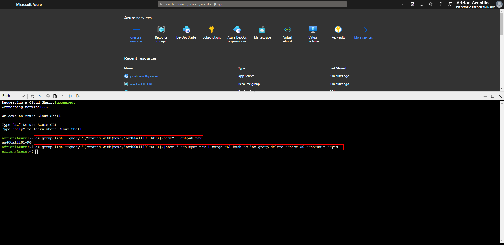


### [<-- Back to readme](../README.md)

