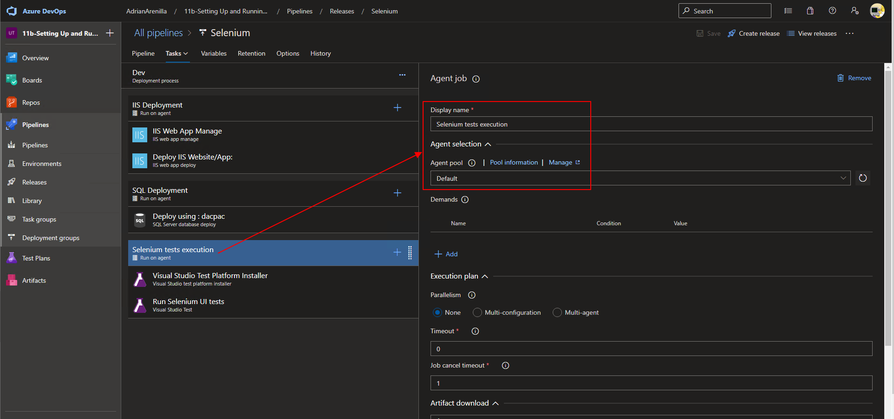

# Microsoft Az-400 (Adrián Arenilla Seco)

## Lab 11B: Setting Up and Running Functional Tests
In this lab, you will learn how to execute Selenium test cases on a C# web application, as part of the Azure DevOps Release pipeline.

### [Go to lab instructions -->](AZ400_M11_Setting_Up_and_Running_Functional_Tests.md)


Project created successfully.


Create Azure resources from custom deployment.


Review all resources created with the template.


Connection to RDP.


Configure a self-hosted Azure DevOps agent.


Edit a release pipeline.


Set up the options of release pipeline Selenium.


Set up the options of release pipeline Selenium.


Set up the options of release pipeline Selenium.



Run pipeline.


Monitor its progress and verify that it completes successfully.


Review the deployed site.


Monitor its progress and verify that it completes successfully.


Review test statistics.


List the resource groups created in the lab for this module by running the following command:
```
az group list --query "[?starts_with(name,'az400m11l02-RG')].name" --output tsv
```

Delete the resource groups that you created in the lab for this module by executing the following command:
```
az group list --query "[?starts_with(name,'az400m11l02-RG')].[name]" --output tsv | xargs -L1 bash -c 'az group delete --name $0 --no-wait --yes'
```


### [<-- Back to readme](../README.md)

