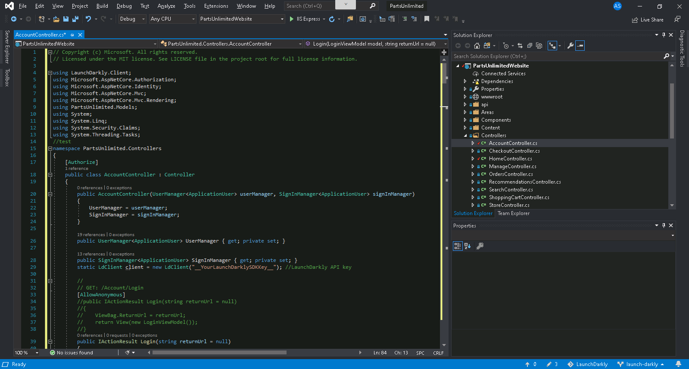
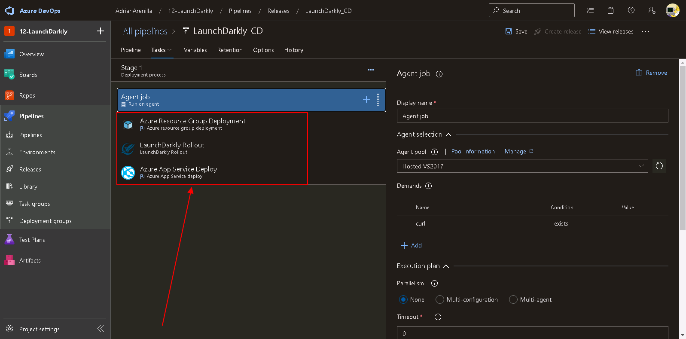

# Microsoft Az-400 (Adrián Arenilla Seco)

## Lab 12: Feature Flag Management with LaunchDarkly and Azure DevOps
In this lab, you will learn how to optimize management of feature flags in Azure DevOps by leveraging LaunchDarkly.

### [Go to lab instructions -->](AZ400_M12_Feature_Flag_Management_with_LaunchDarkly_and_Azure_DevOps.md)

Select the checkbox below the LaunchDarkly Integration V2.

Project created successfully.

Create a feature flag in LaunchDarkly.

Create a feature flag in LaunchDarkly.

Set the Commit mention linking and Commit mention work item resolution settings to On.

Clone the repository into Visual Studio.

Change the branch to launch-darkly.

In the NuGet: PartsUnlimitedWebsite pane, note that LaunchDarkly.Client is already installed.

Verify that the application launches successfully in the local browser session.

Update the HomeController.cs file.

Update the AccountController.cs file.

Update the _Layout.cshtml file.

Update the SDK key of the HomeController.cs file.

Update the SDK key of the AccountController.cs file.

Update the HomeController.cs file.

Verify that the Member portal link no longer appears in the web browser displaying the Parts Unlimited website, since the MemberPortal flag is, at this point, turned off .

In the query results, note the work item ID and click the entry representing the work item.

WorkItem is integrated correctly with LaunchDarkly.

Create a new token in LaunchDarkly portal.

Create a new service connection.

Verify that the connection service has been created correctly.

Associate a feature flag with the work item.

Create a new release pipeline LaunchDarkly_CD.

Set up the options of release pipeline LaunchDarkly_CD.

Create a new personal access token (PAT).

Change the value of this variables.

Create a new release pipeline LaunchDarkly-CI..

Monitor its progress and verify that it completes successfully.

Monitor its progress and verify that it completes successfully.

Verify that the application launches successfully in the local browser session.

Delete the resource group.

### [<-- Back to readme](../README.md)

