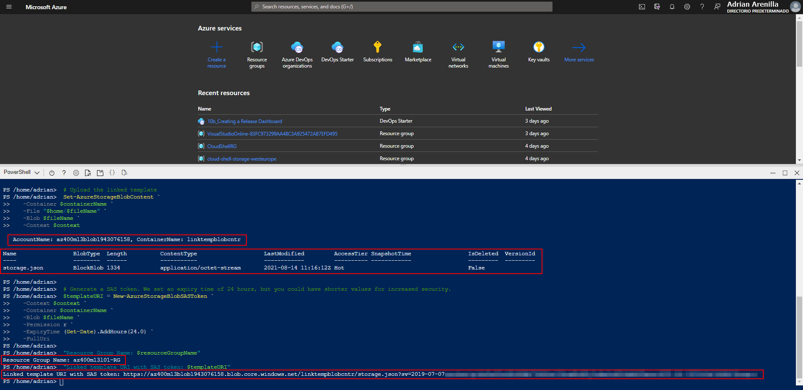

# Microsoft Az-400 (Adrián Arenilla Seco)

## Lab 13: Azure Deployments Using Resource Manager Templates
In this lab, you will learn how to create an Azure Resource Manager (ARM) template and modulate it using the linked template concept. Then you will modify the main deployment template to call the linked template and updated dependencies, and finally you will deploy the templates to Azure.

### [Go to lab instructions -->](AZ400_M13_Azure_Deployments_Using_Resource_Manager_Templates.md)


We create two identical JSON files: azuredeploy.json and storage.json.


Create a Linked template for storage resources (storage.json file update).


The following line of code set a value for the Azure region you want to deploy to.
```
$location = Read-Host -Prompt 'Enter the name of Azure region (i.e. centralus)'
```


Result of creating a resource group, storage account and a blob storage container.


Upload the storage.json file correctly.


Generate a SAS token that you will reference in the main template to access the linked template.



Update the azuredeploy.json file.


Update the azuredeploy.json file.


Update the azuredeploy.json file.


Upload the azuredeploy.json file correctly.


Run the following to perform a deployment by using a newly uploaded template:
```
az deployment group create --name az400m13l01deployment --resource-group az400m13l01-RG --template-file azuredeploy.json
```


Correct deployment.


Verify all resources created with the templates.


List the resource groups created in the lab for this module by running the following command:
```
az group list --query "[?starts_with(name,'az400m13l01-RG')].name" --output tsv
```

Delete the resource groups that you created in the lab for this module by executing the following command:
```
az group list --query "[?starts_with(name,'az400m13l01-RG')].[name]" --output tsv | xargs -L1 bash -c 'az group delete --name $0 --no-wait --yes'
```


### [<-- Back to readme](../README.md)

