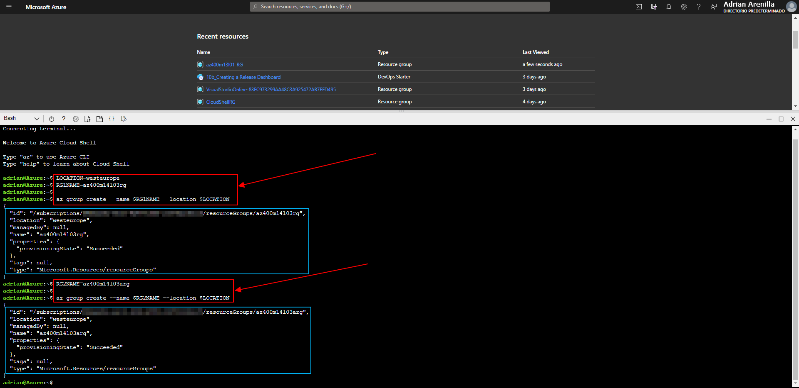

# Microsoft Az-400 (Adrián Arenilla Seco)

## Lab 14A: Ansible with Azure
In this lab we will deploy, configure, and manage Azure resources by using Ansible.

### [Go to lab instructions -->](AZ400_M14_Ansible_with_Azure.md)


Run the code to specify the name of the Azure region that will host the resources you deploy and create resource groups that will host the Azure VMs you deploy.



Run the code to deploy an Azure VM running Ubuntu into the resource group you created.


Run the code to connect to the newly deployed Azure VM by using SSH.


Run the next codes to update the Advanced Packaging Tool (apt) package list to include the latest version and package details.


Run the code to sign in to the Azure AD tenant associated with your Azure subscription.


Enter the code sent and click next to login.


Run the code to generate a system assigned managed identity.


Run the code to identify the value of your subscription by running (SUBSCRIPTIONID), run the code to retrieve the value of the ID property of the built-in Azure Role Based Access Control Contributor role (CONTRIBUTORID) and run the code to assign the Contributor role on the resource group.


Run the code to generate the key pair.


Run the code to grant read, write, and execute permissions on the .ssh folder hosting the private key (chmod 755), run the code to create as well as set read and write permissions on the authorized_keys file (touch and chmod 644) and run the code to add the password to the authorized_keys file (ssh-copy-id).


Run the code to verify that you are not prompted for password.


Edit the new_vm_web.yml file and update the next options: vm_size, admin_username and key_data.


Run the code to create the virtual network and its subnet into which you will deploy an Azure VM by using an ansible playbook.


Run the code to deploy the sample ansible playbook that provisions an Azure VM.


Create a new file named myazure_rm.yml, open it in the Nano text editor and paste the content.


Run the code to perform a ping test, verifying that the dynamic inventory file includes the newly deployed Azure VM.


Run the code to identify the public IP address of the newly deployed Azure VM (PIP), run the code to verify that the newly deployed Azure VM is currently not running any web service (curl http://$PIP) and run the following to install the HTTP service by using the Ansible playbook (sudo ansible-playbook).


Run the code to verify that the newly deployed Azure VM is now running a web service.


List the resource groups created in the lab for this module by running the following command:
```
az group list --query "[?starts_with(name,'az400m14l03')].name" --output tsv
```

Delete the resource groups that you created in the lab for this module by executing the following command:
```
az group list --query "[?starts_with(name,'az400m14l03')].[name]" --output tsv | xargs -L1 bash -c 'az group delete --name $0 --no-wait --yes'
```


### [<-- Back to readme](../README.md)

