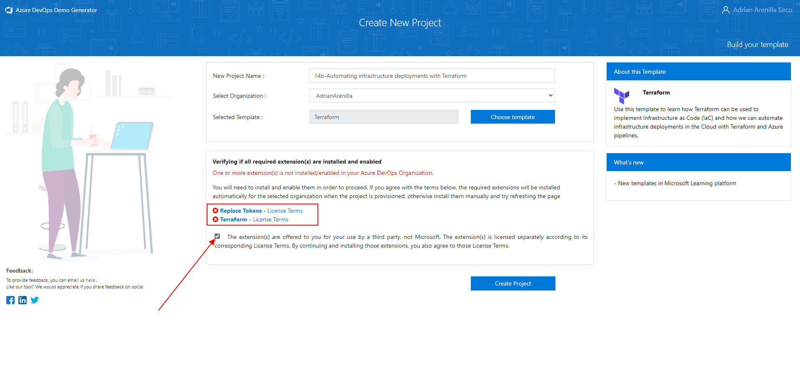
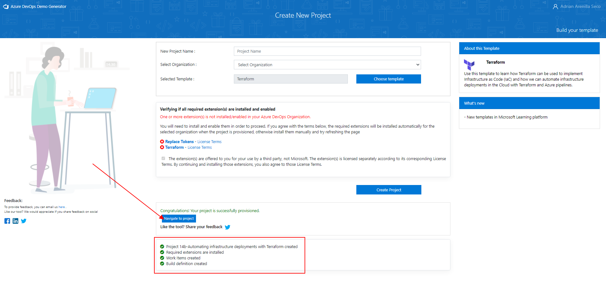

# Microsoft Az-400 (Adrián Arenilla Seco)

## Lab 14B: Automating infrastructure deployments in the Cloud with Terraform and Azure Pipelines
In this lab, you will learn how to incorporate Terraform into Azure Pipelines for implementing Infrastructure as Code.

### [Go to lab instructions -->](AZ400_M14_Automating_infrastructure_deployments_in_the_Cloud_with_Terraform.md)

Select the checkbox below the Replace Tokens and Terraform labels to install extensions.

Project created successfully.

### [<-- Back to readme](../README.md)

