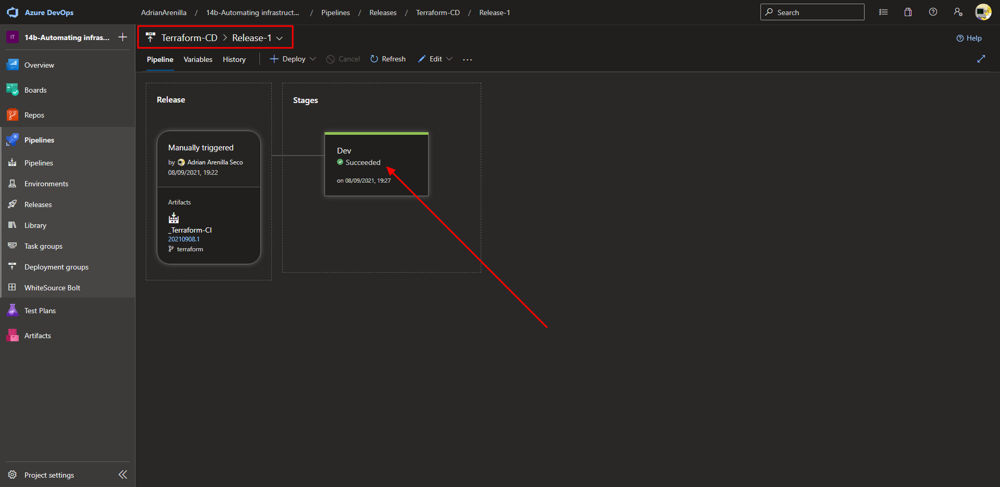

# Microsoft Az-400 (Adrián Arenilla Seco)

## Lab 14B: Automating infrastructure deployments in the Cloud with Terraform and Azure Pipelines
In this lab, you will learn how to incorporate Terraform into Azure Pipelines for implementing Infrastructure as Code.

### [Go to lab instructions -->](AZ400_M14_Automating_infrastructure_deployments_in_the_Cloud_with_Terraform.md)


Select the checkbox below the Replace Tokens and Terraform labels to install extensions.


Project created successfully.


Switch from the master branch to the terraform branch.


Run pipeline.


Monitor its progress and verify that it completes successfully.


On the Artifacts pane, verify that it contains the PartsUnlimitedwebsite.zip file, then expand its Terraform subfolder, and verify that it includes the webapp.tf file.


Update all tasks, save and create release.


Select the version to the _Terraform-CI.


Monitor its progress and verify that it completes successfully.



After deploying the tubing once, deploy again.


Verify within the azure portal that the app service has been created correctly.


Displaying the newly deployed web application.


List the resource groups created in the lab for this module by running the following command:
```
az group list --query '[?contains(`["terraformrg", "PULTerraform"]`, name)].name' --output tsv
```

Delete the resource groups that you created in the lab for this module by executing the following command:
```
az group list --query '[?contains(`["terraformrg", "PULTerraform"]`, name)].name' --output tsv | xargs -L1 bash -c 'az group delete --name $0 --no-wait --yes'
```


### [<-- Back to readme](../README.md)

