# Microsoft Az-400 (Adrián Arenilla Seco)

## Lab 15: Deploying Docker containers to Azure App Service web apps
In this lab, you will learn how to use an Azure DevOps CI/CD pipeline to build a custom Docker image, push it to Azure Container Registry, and deploy it as a container to Azure App Service.

### [Go to lab instructions -->](AZ400_M15_Deploying_Docker_containers_to_Azure_App_Service_web_apps.md)


Project created successfully.
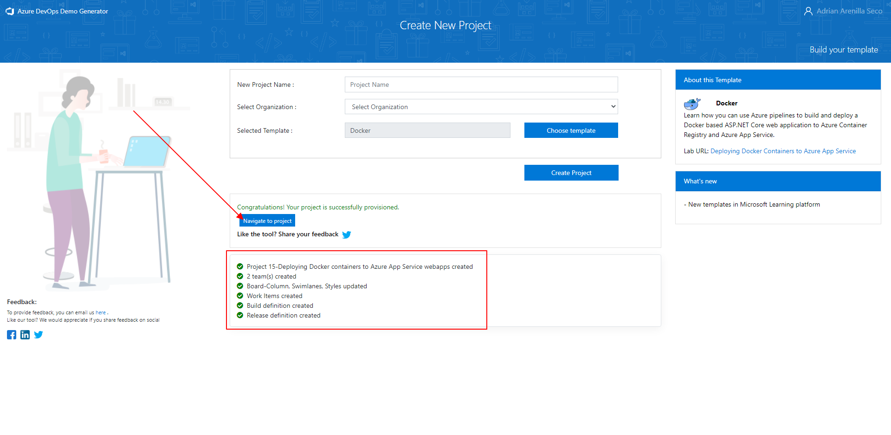


Run the code to create variables representing the location, the names of Azure resources, including an Azure Container Registry instance, an Azure App Service plan name, an Azure web app name, an Azure SQL Database logical server name, and an Azure SQL database name.
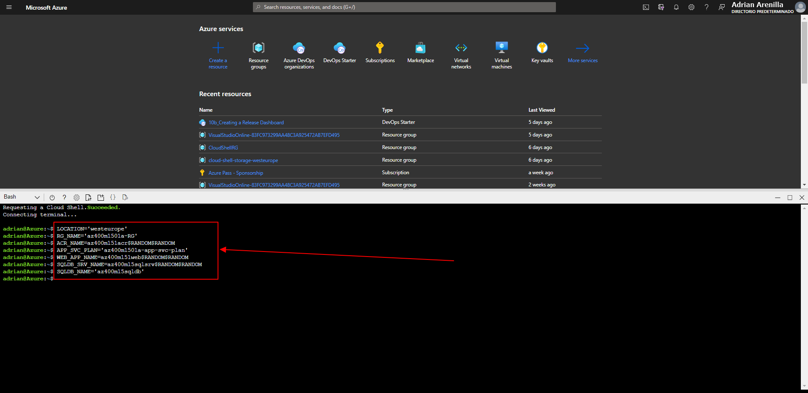


Check that after executing all codes all resources within the resource group have been successfully created.
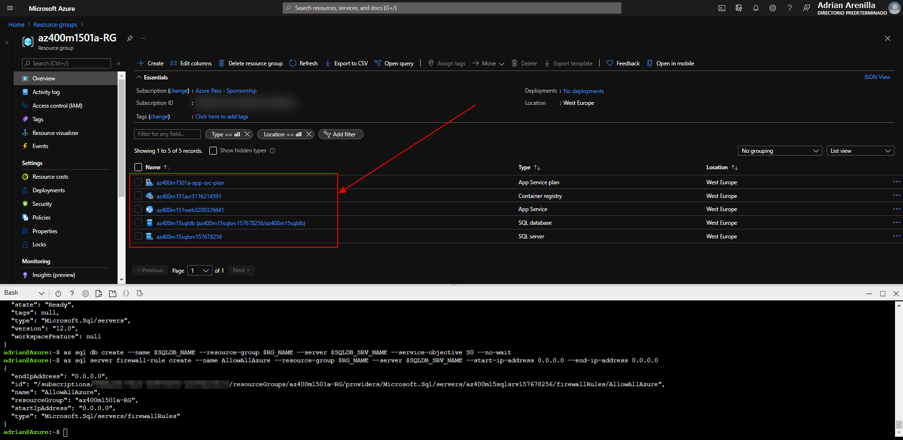


Run the code to configure a connection string of the newly created Azure web app.
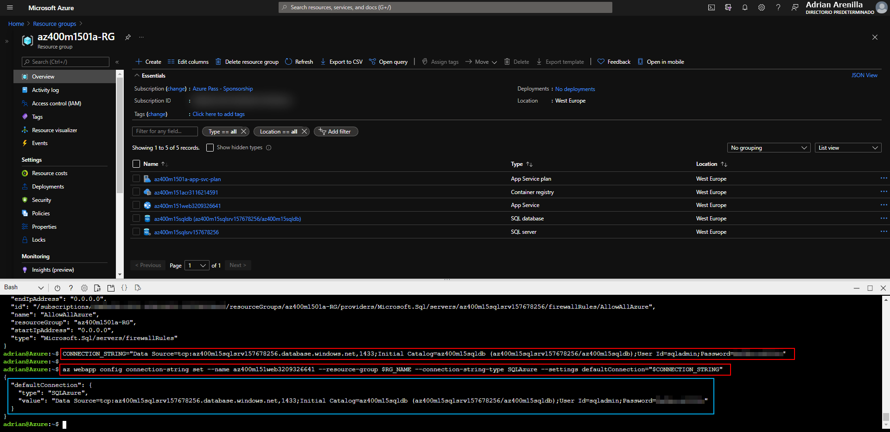


Identify and remember the values of the registry name, login server and password entries.
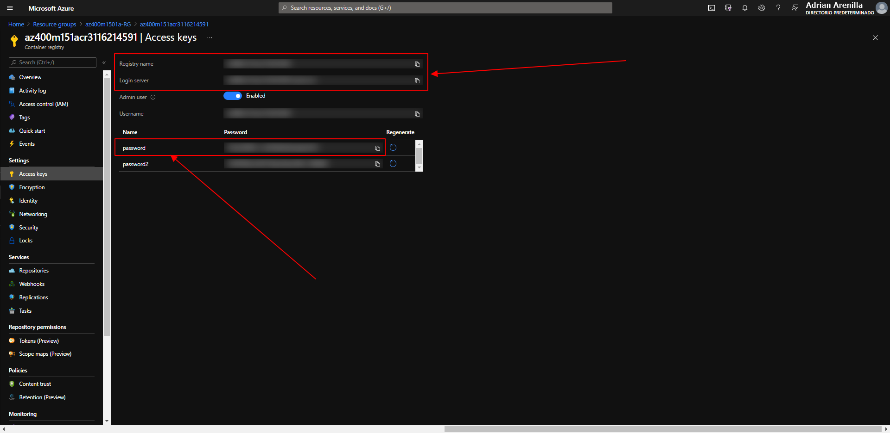


Set up the options of pipeline.
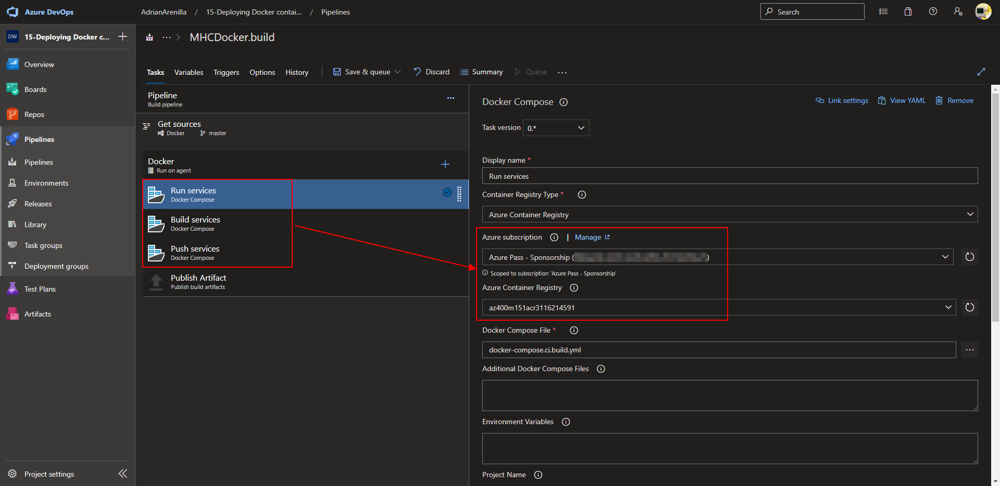


Set up the options of release pipeline.
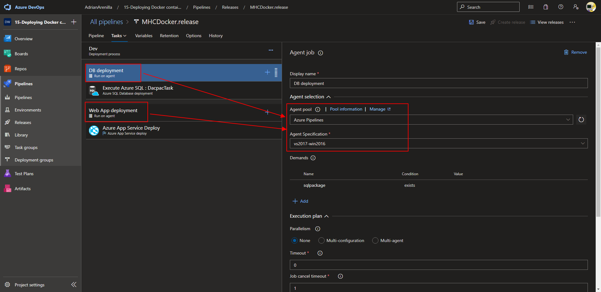


Set up the options of release pipeline.
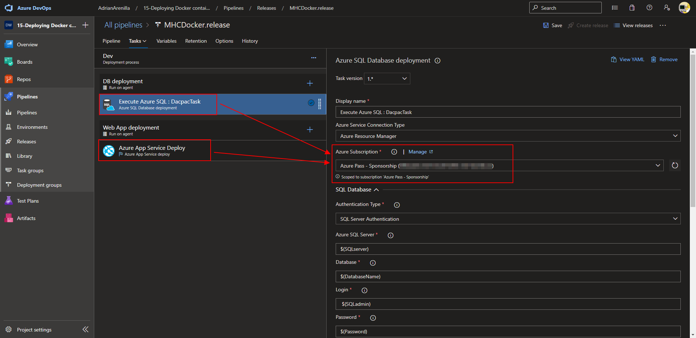


Change the values of variables into release pipeline.
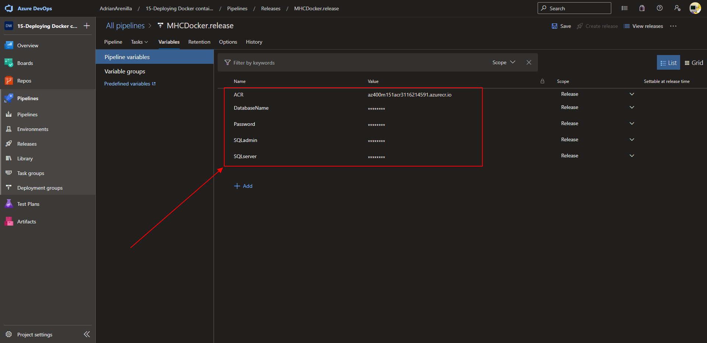


Update Index.cshtml file and Commit to save changes.
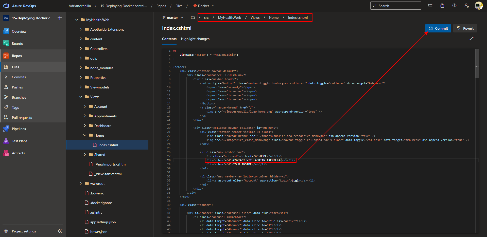


Monitor its progress and verify that it completes successfully. 
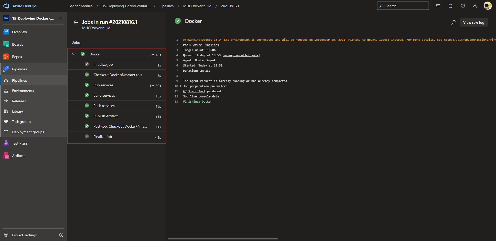


Monitor its progress and verify that it completes successfully. 
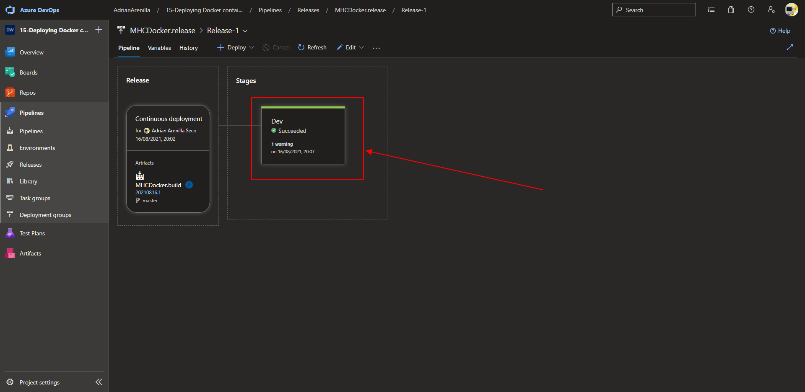


On the App Service web app, click the URL link entry representing the target web app.
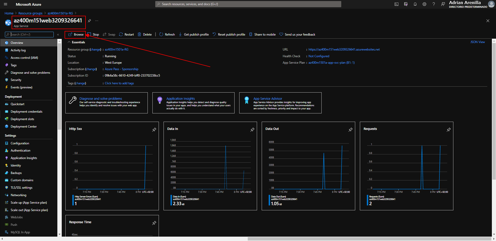


Verify that the page opens correctly with the changes made to the Index.cshtml file.
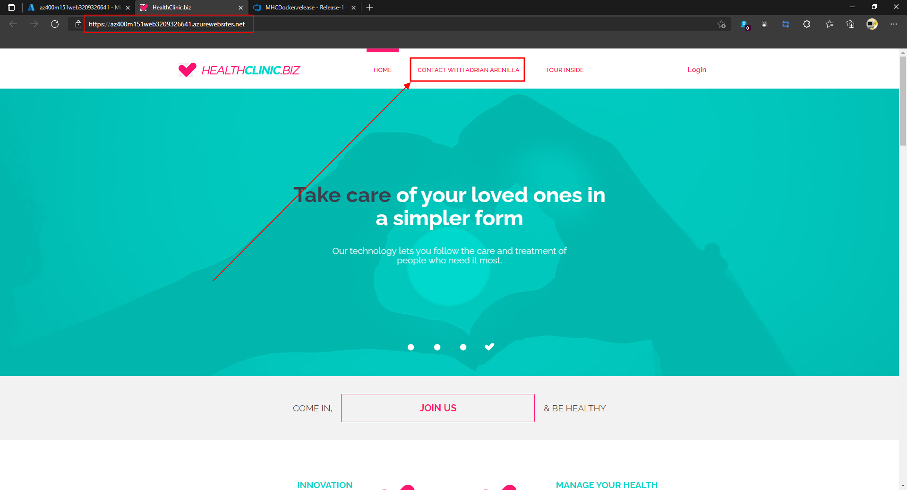


List the resource groups created in the lab for this module by running the following command:
```
az group list --query "[?starts_with(name,'az400m1501')].name" --output tsv
```

Delete the resource groups that you created in the lab for this module by executing the following command:
```
az group list --query "[?starts_with(name,'az400m1501')].[name]" --output tsv | xargs -L1 bash -c 'az group delete --name $0 --no-wait --yes'
```
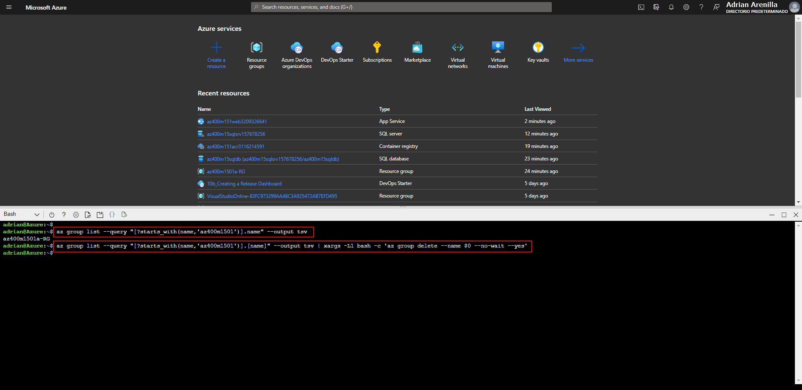


### [<-- Back to readme](../README.md)

