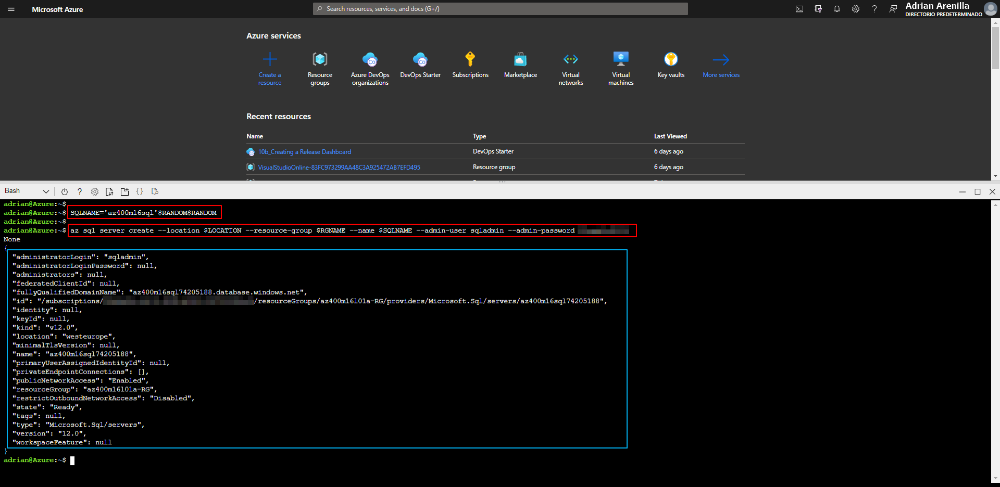
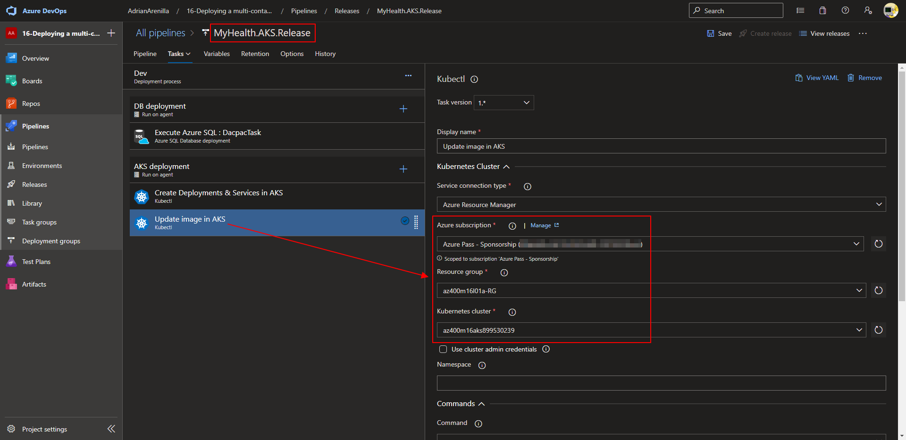

# Microsoft Az-400 (Adrián Arenilla Seco)

## Lab 16: Deploying a multi-container application to Azure Kubernetes Services
In this lab, you will use Azure DevOps to deploy a containerized ASP.NET Core web application MyHealthClinic (MHC) to an AKS cluster.

### [Go to lab instructions -->](AZ400_M16_Deploying_multi-container_application_to_Azure_Kubernetes_Services.md)


Select the checkbox below the Kubernetes extension to install the extension into the project.


Project created successfully.


Run the code to identify the latest version of Kubernetes available in the Azure region and run the code to create a resource group that will host the AKS deployment.


Run the code to create an AKS cluster using the latest version available.


Run the code to create the logical server to host the Azure SQL database.



Run the code to allow access from Azure to the newly provisioned logical server (sql server firewall-rule), run the code to create the Azure SQL database (sql db create) and run the code to create the Azure Container registry.


Run the code to grant the AKS-generated managed identity to access to the newly created ACR.


Run the code to display the name of logical server hosting the Azure SQL and run the code to display the name of the login server of the Azure Container registry.


Set up the options of pipeline.


Set up the options of pipeline.


Change the values of variables into pipeline. 


Set up the options of release pipeline.


Set up the options of release pipeline.


Set up the options of release pipeline.


Set up the options of release pipeline.


Set up the options of release pipeline.


Set up the options of release pipeline.



Set up the options of release pipeline.


Change the values of variables into release pipeline. 


Run pipeline.


Monitor its progress and verify that it completes successfully.


Verify that the AKS is created and running correctly.


Verify that the Kubernetes services are operational and go to the IP.


Verify that the page opens correctly on the IP address.


On the Azure Container registry blade, in the Services section, click Repositories and verify that the list of repositories includes the myhealth.web entry.


Monitor its progress and verify that it completes successfully.


Run the code to gain access to the AKS cluster.


Run the code to list the pods running in AKS that were deployed by using the release pipeline (kubectl get pods) and run the code to list the load balancer service that provides an external IP address via which you can access the containerized application (kubectl get service).


List the resource groups created in the lab for this module by running the following command:
```
az group list --query "[?starts_with(name,'az400m16l01a-RG')].name" --output tsv
```

Delete the resource groups that you created in the lab for this module by executing the following command:
```
az group list --query "[?starts_with(name,'az400m16l01a-RG')].[name]" --output tsv | xargs -L1 bash -c 'az group delete --name $0 --no-wait --yes'
```


### [<-- Back to readme](../README.md)

