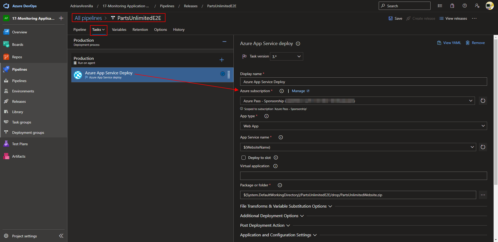
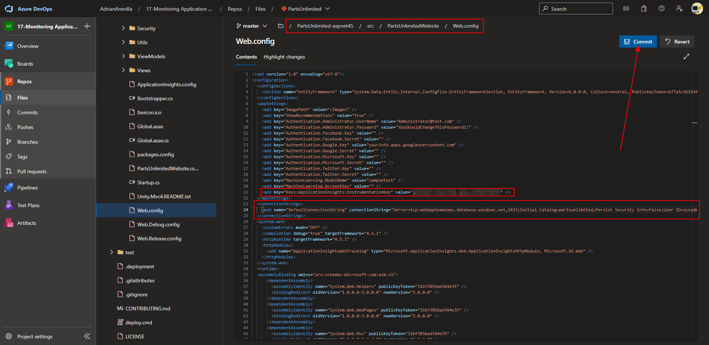
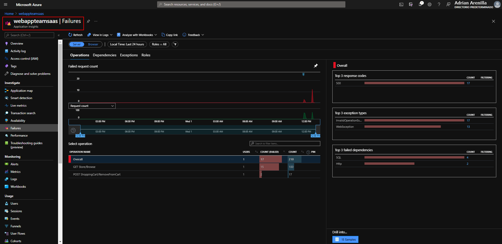
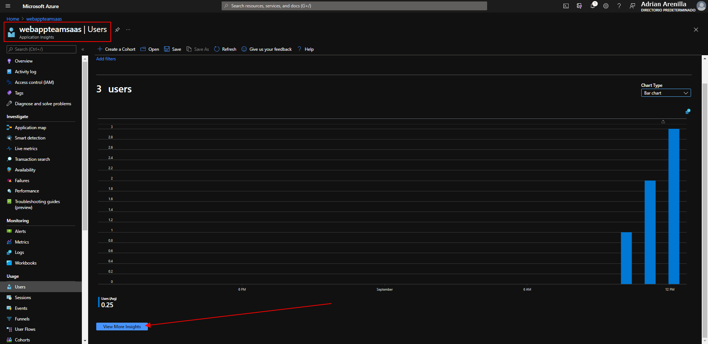

# Microsoft Az-400 (Adrián Arenilla Seco)

## Lab 17: Monitoring Application Performance with Application Insights
In this lab, you'll learn about how you can add Application Insights to an existing web application, as well as how to monitor the application via the Azure portal.

### [Go to lab instructions -->](AZ400_M17_Monitoring_Application_Performance_with_Application_Insights.md)


Project created successfully.


Create a Web App + SQL resource.


Create a Web App + SQL resource.


Delete Dev and QA stages.


Set up the options of release pipeline. 



Change the Pre-deployment condition.


Change the name of the WebsiteName variable inside the pipeline.


Review the lines referencing the Application Insights key and for a SQL connection.



Create a new application setting.


Change the name of defaultConnection.


Monitor its progress and verify that it completes successfully. 


Monitor its progress and verify that it completes successfully. 


Verify that the Parts Unlimited web site loads as expected.


This will trigger a server error since that category does not exist.


Review the resulting Application Insights blade displaying charts presenting different characteristics of the collected data, including the traffic you generated and failed requests you triggered.


Application map graph.


Smart detection graph.


Live metrics graph.


Transaction search graph.


Transaction search graph grouped by results.


Transaction search graph filtered by exception.


End-to-end transaction details view timeline.


End-to-end transaction details view telemetry.


Create a new test within availability graph.


Failures graph.



Details of the failures graph.


Performance graph.


Metrics graph splited by operations name.


Users graph.



More details of users graph.


More details of events graph.


Select an event to view the user flow.


User flows graph.


Analysis of page views graph.


Add a condition on an alert rule.


Create action group on an alert rule.


Define the type of notification within the action group.


Create alert rule with all parameter configurated.


Alert delivered in the mail.


List the resource groups created in the lab for this module by running the following command:
```
az group list --query "[?starts_with(name,'az400m17l01')].name" --output tsv
```

Delete the resource groups that you created in the lab for this module by executing the following command:
```
az group list --query "[?starts_with(name,'az400m17l01')].[name]" --output tsv | xargs -L1 bash -c 'az group delete --name $0 --no-wait --yes'
```


### [<-- Back to readme](../README.md)

