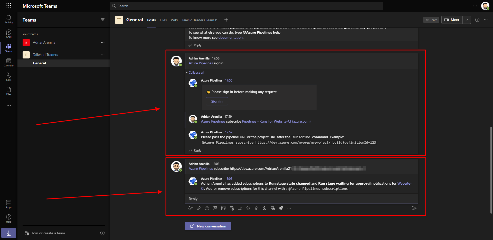

# Microsoft Az-400 (Adrián Arenilla Seco)

## Lab 18: Integration between Azure DevOps and Teams
In this lab, you will implement integration scenarios between Azure DevOps services and Microsoft Teams.

### [Go to lab instructions -->](AZ400_M18_Integration_between_Azure_DevOps_and_Teams.md)

Project created successfully.

Integrate Azure Boards with Microsoft Teams

Choose the organization and project name to install Azure Boards.

Choose in which channel to add Azure Boards.

Sign in to your Azure Boards account.

Add a tab with redirection to our Azure Boards.

Ensure that it contains the content matching the Tailwind Traders Team board available in the Azure DevOps portal.

Integrate Azure Pipelines with Microsoft Teams.

Choose in which channel to add Azure Pipelines.

Sign in to your Azure Pipelines account.

Subscribe to the Azure Pipeline notifications in Microsoft Teams.

Using filters to customize subscriptions to Azure Pipelines in Microsoft Teams.

Create a new channels in Microsoft Teams.

Share content in Microsoft Teams.

Add a tab with redirection to our Azure Wiki.

### [<-- Back to readme](../README.md)
