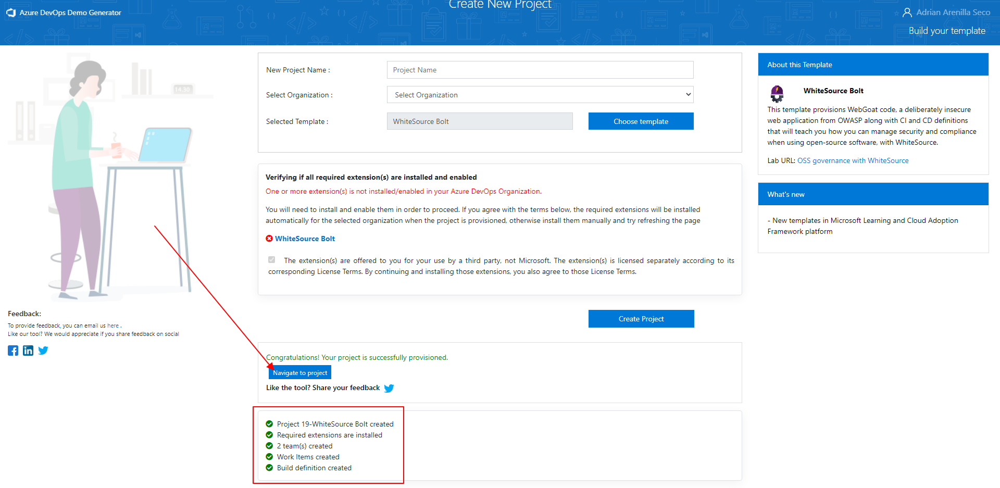
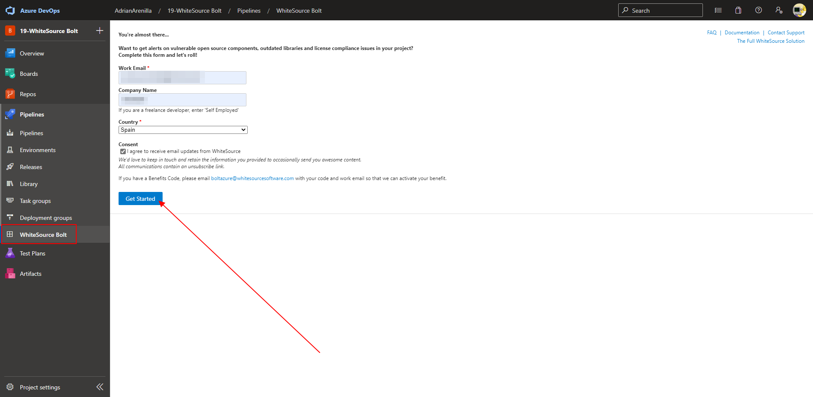
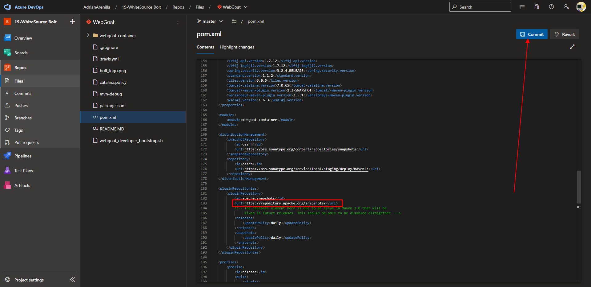
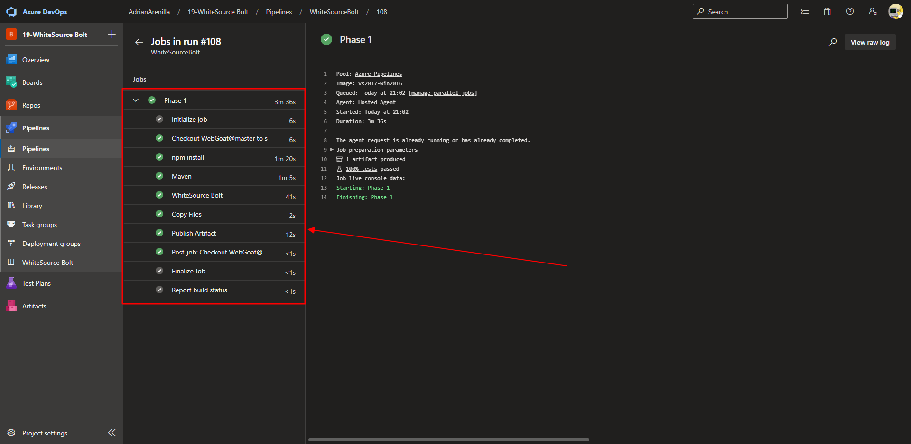
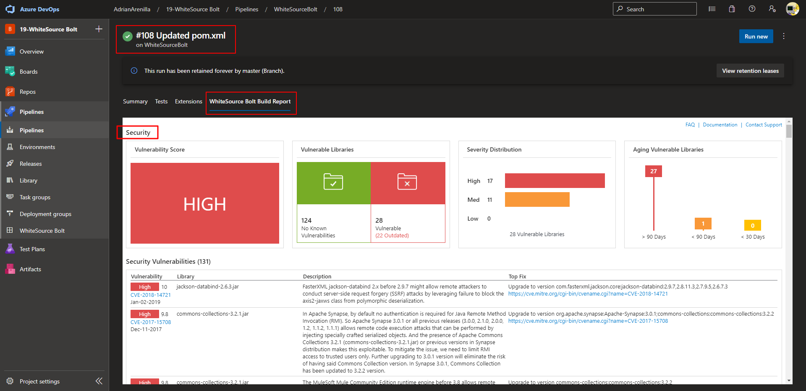
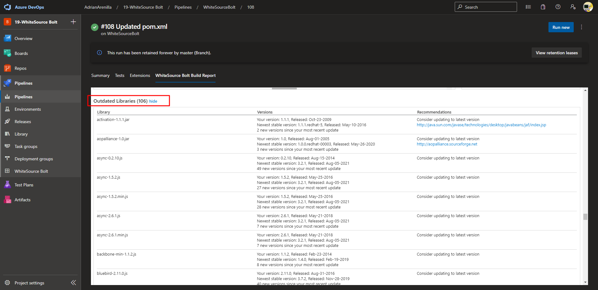

# Microsoft Az-400 (Adrián Arenilla Seco)

## Lab 19: Implement Security and Compliance in an Azure DevOps pipeline
In this lab, you will use WhiteSource Bolt with Azure DevOps to automatically detect vulnerable open source components, outdated libraries, and license compliance issues in your code. You will leverage WebGoat, an intentionally insecure web application, maintained by OWASP designed to illustrate common web application security issues.

### [Go to lab instructions -->](AZ400_M19_Implement_Security_and_Compliance_in_an_Azure_DevOps_pipeline.md)

Project created successfully.

On the You're almost there pane, provide your Work Email and Company Name, in the Country drop-down list, select the entry representing your country, and click Get Started button to start using the Free version of WhiteSource Bolt.

Edit the pom.xml file to change the URL and Commit.

Monitor its progress and verify that it completes successfully. 

Review the Security dashboard, displaying the vulnerabilities discovered during the build.

WhiteSource Bolt tracks outdated libraries in the project, providing library details, links to newer versions, and remediation recommendations.

### [<-- Back to readme](../README.md)

