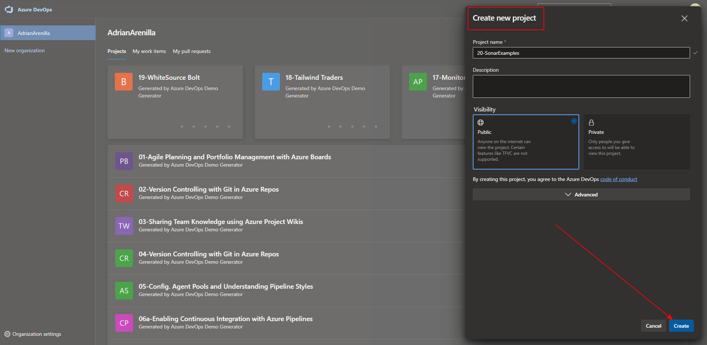
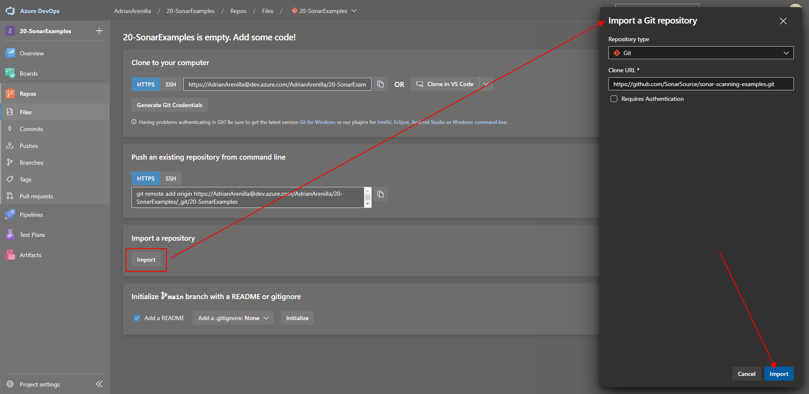
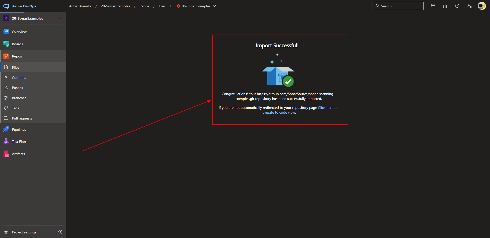

# Microsoft Az-400 (Adrián Arenilla Seco)

## Lab 20: Managing technical debt with SonarCloud and Azure DevOps
In this lab, you will learn how to integrate Azure DevOps Services with SonarCloud.

### [Go to lab instructions -->](AZ400_M20_Managing_technical_debt_with_SonarQube_and_Azure_DevOps.md)


Create a new DevOps project.


Choose the name and the visibility and click on create.



Import a Git repository.



Verify that the import is successful.



Create a new personal access token (PAT).


Get the SonarCloud extension from the Visual Studio Marketplace.


Install within your DevOps organization.


Log in with Azure DevOps.


Choose import an organization from Azure.


Review the data an click on Create Organization.


Choose the DevOps project and click on Set Up.


Continue to install the extension and view all data from the project.


Create a new pipeline.


Create a new service connection.


Choose SonarCloud to connect to it.


Verify that the SonarCloud token is valid and choose a service connection name.


Modify the azure-pipelines.yml file and click on Save and run.


Monitor its progress and verify that it completes successfully. 


Create a new pipeline but now choose classic editor.


The source is Azure Repos Git and check the rest of the options and Continue.


Choose .NET Desktop with SonarCloud template and Apply.


Create a new service connection within the task Prepare analysis on SonarCloud verifying the SonarCloud token.


Set up the options of pipeline. 


Monitor its progress and verify that it completes successfully. 


To be able to see the Quality gate result, after running he first report we need to set New Code Definition. This way, subsequent pipeline runs will include Quality Gate results.


Choose Previous version.


Monitor its progress and verify that it completes successfully. 


Monitor its progress and verify that it completes successfully. 


Verify that the report now includes the Quality Gate result and click the number designating the count of Bugs.


Review the error details in line number 9 of Program.cs file, including the recommendation stating Change this condition so that it does not always evaluate to 'true'; some subsequent code is never executed.


Configure pull request integration in SonarCloud by assigning an Azure DevOps personal access token to your SonarCloud project.


Configure pull request integration in SonarCloud.


Configure pull request integration in SonarCloud.


On the **Program.cs** pane, add the following empty method to the code directly above the line `public static bool AlwaysReturnsTrue()` and Commit.
```
public void Unused(){}
```


Choose a new branch name and Commit.


Monitor its progress and verify that it completes successfully. 


Review the results of the SonarCloud checks and close the pane.


Block pull requests in response to failing Code Quality checks.


Click on complete to join the branches.


### [<-- Back to readme](../README.md)

